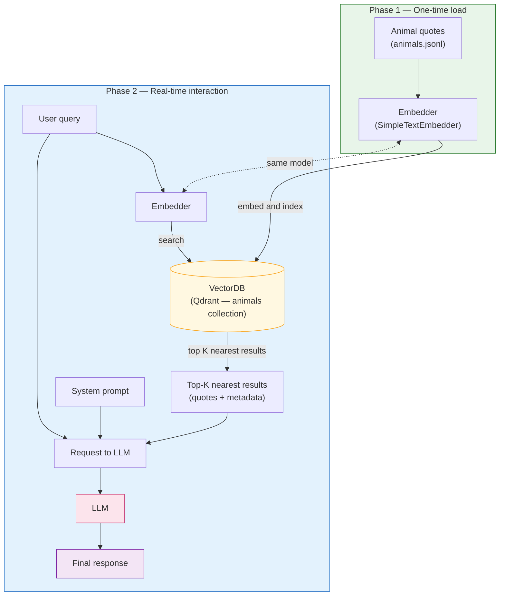

# Animal quotes RAG flow

High-level flow for the **RAG to Riches** animal-quotes tutorial: index quotes once, then answer user questions with retrieval-augmented generation.

Original sketch: [`animal-rag-flow.png`](animal-rag-flow.png)

## Diagram

## Phase summary

| Phase | When | What happens |
|-------|------|----------------|
| **One-time load** | Setup / re-index | Each animal quote is embedded and stored in the vector database with metadata (author, category, etc.). |
| **Real-time interaction** | Each user question | The query is embedded, similar quotes are retrieved, then the LLM receives the system prompt, the user query, and the top-K context to produce the final answer. |

## Components in this repo

- **Corpus**: `data/corpus/animals/animals.jsonl` — loaded by [`Animals`](src/rag_to_riches/corpus/animals.py)
- **Embedder**: [`SimpleTextEmbedder`](src/rag_to_riches/vectordb/embedder.py)
- **Vector DB**: [`EmbeddedVectorDB`](src/rag_to_riches/vectordb/embedded_vectordb.py) (Qdrant)
- **End-to-end demo**: [`example_animals_usage.py`](src/examples/example_animals_usage.py) (index + search); full RAG via `Animals.ask_llm()` / `Animals.rag()`
