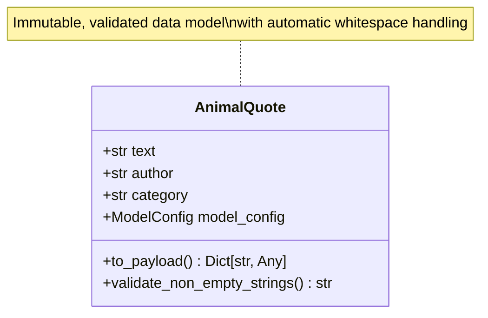

# AnimalQuote Class: Individual Quote Data Model

## 🎯 Class Overview

The `AnimalQuote` class is a Pydantic data model that represents a single animal quote with comprehensive metadata. It provides robust validation, immutable data structures, and seamless integration with vector databases for semantic search applications.

This class serves as the fundamental building block for the animal quotes corpus, ensuring data integrity and providing convenient methods for working with individual quotes.

## 📋 Class Definition

```python
class AnimalQuote(BaseModel):
    """Represents a single animal quote with metadata.
    
    This model captures the structure of each line in the animals.jsonl file,
    containing the quote text, author attribution, and thematic category.
    """
```

### 🏗️ Class Architecture



## 🔧 Model Configuration

The class uses strict Pydantic configuration for data integrity:

```python
model_config = ConfigDict(
    str_strip_whitespace=True,    # Automatically strip whitespace
    validate_assignment=True,     # Validate on field assignment
    frozen=True,                  # Immutable after creation
    extra="forbid"               # Reject extra fields
)
```

### Configuration Features

- **Automatic Whitespace Stripping**: All string fields are automatically trimmed
- **Assignment Validation**: Changes to fields are validated in real-time
- **Immutable Objects**: Quotes cannot be modified after creation (data integrity)
- **Strict Schema**: Extra fields are rejected to prevent data corruption

## 📊 Fields

### `text: str`

The actual quote content - the wisdom, insight, or saying attributed to animal behavior or human-animal relationships.

**Validation Rules:**
- Must be non-empty after whitespace stripping
- Minimum length: 1 character
- Automatically trimmed of leading/trailing whitespace

**Example Values:**
```python
"Dogs are not our whole life, but they make our lives whole."
"The greatness of a nation can be judged by the way its animals are treated."
"Until one has loved an animal, a part of one's soul remains unawakened."
```

### `author: str`

Attribution of the quote to its original author - the person who said, wrote, or is credited with the wisdom.

**Validation Rules:**
- Must be non-empty after whitespace stripping
- Minimum length: 1 character
- Automatically trimmed of leading/trailing whitespace

**Example Values:**
```python
"Roger Caras"
"Mahatma Gandhi"
"Anatole France"
"Albert Schweitzer"
```

### `category: str`

Thematic categorization that groups related quotes for easier discovery and filtering.

**Validation Rules:**
- Must be non-empty after whitespace stripping
- Minimum length: 1 character
- Automatically trimmed of leading/trailing whitespace

**Example Values:**
```python
"Pets and Companionship"
"Ethics and Compassion"
"Wisdom and Philosophy"
"Animal Behavior"
"Conservation and Nature"
```

## 🔍 Methods

### `validate_non_empty_strings(cls, v: str) -> str`

Class method validator that ensures all string fields are non-empty after stripping whitespace.

#### Parameters

| Parameter | Type | Description |
|-----------|------|-------------|
| `v` | `str` | The string value to validate |

#### Returns

`str` - The validated and trimmed string

#### Raises

`ValueError` - If the field is empty or contains only whitespace

#### Implementation

```python
@field_validator('text', 'author', 'category')
@classmethod
def validate_non_empty_strings(cls, v: str) -> str:
    """Ensure all string fields are non-empty after stripping."""
    if not v or not v.strip():
        raise ValueError("Field cannot be empty or whitespace only")
    return v.strip()
```

### `to_payload(self) -> Dict[str, Any]`

Convert the quote to a payload dictionary suitable for vector database storage.

#### Returns

`Dict[str, Any]` - Dictionary with standardized keys for Qdrant point payload

#### Return Structure

```python
{
    "content": self.text,           # The quote text for searching
    "content_type": "animal_quote", # Type identifier
    "author": self.author,          # Author attribution
    "category": self.category       # Thematic category
}
```

#### Example Usage

```python
quote = AnimalQuote(
    text="Dogs are loyal companions who teach us about unconditional love.",
    author="Unknown",
    category="Pets and Companionship"
)

payload = quote.to_payload()
print(payload)
# Output:
# {
#     "content": "Dogs are loyal companions who teach us about unconditional love.",
#     "content_type": "animal_quote",
#     "author": "Unknown", 
#     "category": "Pets and Companionship"
# }
```

#### Use Cases

- Storing quotes in vector databases (Qdrant points)
- Serializing for API responses
- Converting to search metadata
- Preparing data for machine learning pipelines

## 💡 Usage Examples

### Basic Creation

```python
from rag_to_riches.corpus.data_models import AnimalQuote

# Create a simple quote
quote = AnimalQuote(
    text="A dog is the only thing on earth that loves you more than you love yourself.",
    author="Josh Billings",
    category="Pets and Companionship"
)

print(f"Quote: {quote.text}")
print(f"By: {quote.author}")
print(f"Category: {quote.category}")
```

### From JSONL Data

```python
import json

# Typical JSONL line
jsonl_line = '{"text": "Animals are such agreeable friends—they ask no questions; they pass no criticisms.", "author": "George Eliot", "category": "Friendship and Understanding"}'

# Parse and create quote
data = json.loads(jsonl_line)
quote = AnimalQuote(**data)

print(f"Created quote: {quote.text[:50]}...")
```

### Validation in Action

```python
# This will work - valid data
good_quote = AnimalQuote(
    text="  Cats choose us; we don't own them.  ",  # Whitespace will be stripped
    author="Kristin Cast",
    category="Pet Wisdom"
)

# This will fail - empty text after stripping
try:
    bad_quote = AnimalQuote(
        text="   ",  # Only whitespace
        author="Someone",
        category="Some Category"
    )
except ValueError as e:
    print(f"Validation error: {e}")
```

### Immutability Demonstration

```python
quote = AnimalQuote(
    text="Dogs have a way of finding the people who need them.",
    author="Thom Jones",
    category="Healing and Therapy"
)

# This will fail - objects are frozen
try:
    quote.text = "New text"
except ValueError as e:
    print(f"Cannot modify: {e}")
```

### Vector Database Integration

```python
# Convert to payload for storage
quote = AnimalQuote(
    text="The bond with a dog is as lasting as the ties of this earth can ever be.",
    author="Konrad Lorenz",
    category="Human-Animal Bond"
)

# Prepare for vector database
payload = quote.to_payload()

# This payload can be used with Qdrant points
point_id = str(uuid4())
vector = embedder.embed_text(quote.text)

point = models.PointStruct(
    id=point_id,
    vector=vector,
    payload=payload
)
```

## 🛡️ Error Handling

### Common Validation Errors

#### Empty Fields

```python
# These will all raise ValueError
try:
    AnimalQuote(text="", author="Author", category="Category")
except ValueError:
    print("Empty text not allowed")

try:
    AnimalQuote(text="Quote", author="   ", category="Category")  
except ValueError:
    print("Whitespace-only author not allowed")

try:
    AnimalQuote(text="Quote", author="Author", category=None)
except ValueError:
    print("None values not allowed")
```

#### Extra Fields

```python
# This will fail due to extra="forbid"
try:
    AnimalQuote(
        text="Quote",
        author="Author", 
        category="Category",
        extra_field="Not allowed"
    )
except ValueError:
    print("Extra fields not permitted")
```

#### Type Errors

```python
# This will fail - wrong types
try:
    AnimalQuote(
        text=123,  # Should be string
        author="Author",
        category="Category"
    )
except ValueError:
    print("Text must be a string")
```

## 🔗 Integration Points

### With AnimalWisdom

```python
from rag_to_riches.corpus.data_models import AnimalWisdom

quotes = [
    AnimalQuote(text="Quote 1", author="Author 1", category="Category A"),
    AnimalQuote(text="Quote 2", author="Author 2", category="Category B"),
]

wisdom = AnimalWisdom(quotes=quotes)
```

### With Vector Databases

```python
# Batch conversion for indexing
quotes = [...]  # List of AnimalQuote objects
payloads = [quote.to_payload() for quote in quotes]
texts = [quote.text for quote in quotes]

# Ready for semantic search indexing
semantic_search.index_all_text(texts=texts, metadata_list=payloads)
```

### With JSON Serialization

```python
# Pydantic provides JSON serialization
quote = AnimalQuote(text="Quote", author="Author", category="Category")

# To JSON
json_str = quote.model_dump_json()

# From JSON  
quote_copy = AnimalQuote.model_validate_json(json_str)
```

## 🎯 Design Principles

### Data Integrity

- **Immutable**: Once created, quotes cannot be modified
- **Validated**: All fields are checked for correctness
- **Consistent**: Automatic whitespace handling ensures clean data

### Performance

- **Lightweight**: Minimal overhead for individual quotes
- **Efficient**: Fast validation and serialization
- **Memory-friendly**: Frozen objects can be safely shared

### Usability

- **Clear API**: Simple, intuitive field names and methods
- **Rich Errors**: Detailed error messages for debugging
- **Integration-ready**: Designed for vector database and AI workflows

## 🔍 Advanced Usage

### Custom Validation

```python
from pydantic import field_validator

class ExtendedAnimalQuote(AnimalQuote):
    @field_validator('category')
    @classmethod
    def validate_category(cls, v):
        valid_categories = [
            "Pets and Companionship",
            "Ethics and Compassion", 
            "Wisdom and Philosophy",
            "Animal Behavior",
            "Conservation and Nature"
        ]
        if v not in valid_categories:
            raise ValueError(f"Category must be one of: {valid_categories}")
        return v
```

### Batch Processing

```python
# Process multiple quotes efficiently
jsonl_data = [
    {"text": "Quote 1", "author": "Author 1", "category": "Category A"},
    {"text": "Quote 2", "author": "Author 2", "category": "Category B"},
    # ... more quotes
]

quotes = []
for data in jsonl_data:
    try:
        quote = AnimalQuote(**data)
        quotes.append(quote)
    except ValueError as e:
        print(f"Skipping invalid quote: {e}")

print(f"Successfully created {len(quotes)} quotes")
```

## 📚 Source Code

::: rag_to_riches.corpus.data_models.AnimalQuote
    options:
      show_source: true
      show_root_heading: true
      show_root_toc_entry: true

---

*The AnimalQuote class exemplifies modern data modeling best practices - combining Pydantic's validation power with domain-specific requirements to create robust, reliable data structures for RAG applications.* 