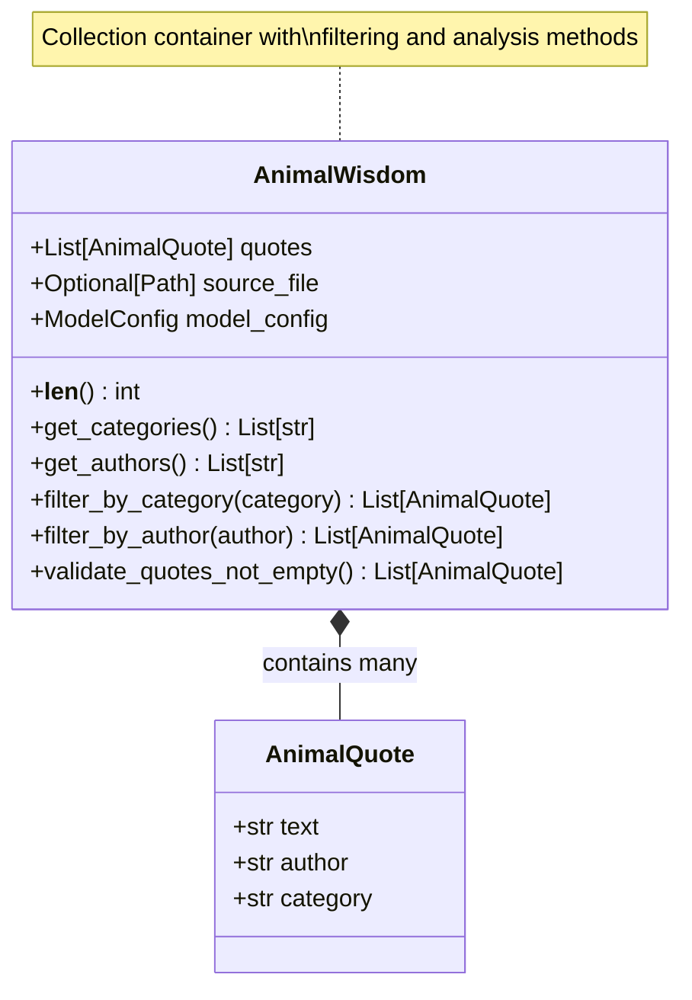

# AnimalWisdom Class: Quote Collection Management

## 🎯 Class Overview

The `AnimalWisdom` class is a sophisticated Pydantic data model that represents a complete collection of animal quotes. It provides validation, convenient access methods, and powerful filtering capabilities for managing large sets of quotes loaded from corpus files.

This class serves as the primary container for quote collections, offering both data integrity and rich functionality for exploring and analyzing animal wisdom across different authors, categories, and themes.

## 📋 Class Definition

```python
class AnimalWisdom(BaseModel):
    """Collection of animal quotes loaded from the corpus.
    
    This model represents the complete collection of animal quotes,
    providing validation and convenient access methods for the data.
    """
```

### 🏗️ Class Architecture



## 🔧 Model Configuration

The class uses flexible Pydantic configuration for collection management:

```python
model_config = ConfigDict(
    validate_assignment=True,      # Validate on field assignment
    arbitrary_types_allowed=True   # Allow Path objects
)
```

### Configuration Features

- **Assignment Validation**: Changes to the collection are validated
- **Type Flexibility**: Supports Path objects for source file tracking
- **Mutable Collections**: Allows for dynamic quote management
- **Extensible Design**: Ready for additional metadata and features

## 📊 Fields

### `quotes: List[AnimalQuote]`

The core collection of animal quotes, each represented as a validated `AnimalQuote` instance.

**Validation Rules:**
- Must contain at least one quote (non-empty list)
- All items must be valid `AnimalQuote` instances
- Validated on assignment and initialization

**Example Structure:**
```python
quotes = [
    AnimalQuote(
        text="Dogs are not our whole life, but they make our lives whole.",
        author="Roger Caras",
        category="Pets and Companionship"
    ),
    AnimalQuote(
        text="The greatness of a nation can be judged by the way its animals are treated.",
        author="Mahatma Gandhi", 
        category="Ethics and Compassion"
    ),
    # ... more quotes
]
```

### `source_file: Optional[Path]`

Optional path to the source JSONL file from which the quotes were loaded. Useful for tracking data provenance and enabling reload operations.

**Features:**
- Tracks the origin of the quote collection
- Enables data lineage and debugging
- Supports reload and refresh operations
- Can be None for programmatically created collections

**Example Values:**
```python
source_file = Path("data/corpus/animals/animals.jsonl")
source_file = Path("/home/user/quotes/wisdom_collection.jsonl")
source_file = None  # For programmatically created collections
```

## 🔍 Methods

### `__len__(self) -> int`

Return the number of quotes in the collection.

#### Returns

`int` - Total count of quotes in the collection

#### Example Usage

```python
wisdom = AnimalWisdom(quotes=[...])
print(f"Collection contains {len(wisdom)} quotes")

# Use in conditionals
if len(wisdom) > 100:
    print("Large collection detected")
```

### `get_categories(self) -> List[str]`

Get unique categories from all quotes in the collection.

#### Returns

`List[str]` - Sorted list of unique category names

#### Example Usage

```python
categories = wisdom.get_categories()
print(f"Available categories ({len(categories)}):")
for category in categories:
    print(f"  - {category}")

# Example output:
# Available categories (5):
#   - Animal Behavior
#   - Ethics and Compassion
#   - Pets and Companionship
#   - Wisdom and Philosophy
#   - Wildlife and Conservation
```

#### Use Cases

- Building category filters for search interfaces
- Analyzing thematic distribution of quotes
- Creating navigation menus
- Generating collection statistics

### `get_authors(self) -> List[str]`

Get unique authors from all quotes in the collection.

#### Returns

`List[str]` - Sorted list of unique author names

#### Example Usage

```python
authors = wisdom.get_authors()
print(f"Quotes from {len(authors)} different authors:")
for author in authors[:10]:  # Show first 10
    print(f"  - {author}")

# Find most prolific authors
author_counts = {}
for quote in wisdom.quotes:
    author_counts[quote.author] = author_counts.get(quote.author, 0) + 1

top_authors = sorted(author_counts.items(), key=lambda x: x[1], reverse=True)
print(f"Most quoted author: {top_authors[0][0]} ({top_authors[0][1]} quotes)")
```

#### Use Cases

- Author-based filtering and search
- Attribution analysis and verification
- Building author indexes
- Identifying collection coverage and gaps

### `filter_by_category(self, category: str) -> List[AnimalQuote]`

Filter quotes by category, returning all quotes that match the specified category.

#### Parameters

| Parameter | Type | Description |
|-----------|------|-------------|
| `category` | `str` | Category name to filter by (exact match) |

#### Returns

`List[AnimalQuote]` - List of quotes matching the specified category

#### Example Usage

```python
# Get all quotes about pets
pet_quotes = wisdom.filter_by_category("Pets and Companionship")
print(f"Found {len(pet_quotes)} quotes about pets:")

for quote in pet_quotes[:3]:
    print(f"  '{quote.text}' - {quote.author}")

# Analyze category distribution
ethics_quotes = wisdom.filter_by_category("Ethics and Compassion")
wisdom_quotes = wisdom.filter_by_category("Wisdom and Philosophy")

print(f"Ethics quotes: {len(ethics_quotes)}")
print(f"Wisdom quotes: {len(wisdom_quotes)}")
```

#### Use Cases

- Thematic exploration of quotes
- Building category-specific collections
- Content curation for specific topics
- Analyzing quote distribution across themes

### `filter_by_author(self, author: str) -> List[AnimalQuote]`

Filter quotes by author, returning all quotes attributed to the specified author.

#### Parameters

| Parameter | Type | Description |
|-----------|------|-------------|
| `author` | `str` | Author name to filter by (exact match) |

#### Returns

`List[AnimalQuote]` - List of quotes by the specified author

#### Example Usage

```python
# Get all quotes by Gandhi
gandhi_quotes = wisdom.filter_by_author("Mahatma Gandhi")
print(f"Gandhi's quotes about animals ({len(gandhi_quotes)}):")

for quote in gandhi_quotes:
    print(f"  '{quote.text}'")
    print(f"  Category: {quote.category}")
    print()

# Compare authors
einstein_quotes = wisdom.filter_by_author("Albert Einstein")
schweitzer_quotes = wisdom.filter_by_author("Albert Schweitzer")

print(f"Einstein: {len(einstein_quotes)} quotes")
print(f"Schweitzer: {len(schweitzer_quotes)} quotes")
```

#### Use Cases

- Author-focused research and analysis
- Building author-specific quote collections
- Verifying attribution and coverage
- Comparative analysis between authors

### `validate_quotes_not_empty(cls, v: List[AnimalQuote]) -> List[AnimalQuote]`

Class method validator that ensures the quotes collection is not empty.

#### Parameters

| Parameter | Type | Description |
|-----------|------|-------------|
| `v` | `List[AnimalQuote]` | The quotes list to validate |

#### Returns

`List[AnimalQuote]` - The validated quotes list

#### Raises

`ValueError` - If the quotes collection is empty

#### Implementation

```python
@field_validator('quotes')
@classmethod
def validate_quotes_not_empty(cls, v: List[AnimalQuote]) -> List[AnimalQuote]:
    """Ensure quotes list is not empty."""
    if not v:
        raise ValueError("Quotes collection cannot be empty")
    return v
```

## 💡 Usage Examples

### Basic Creation

```python
from pathlib import Path
from rag_to_riches.corpus.data_models import AnimalQuote, AnimalWisdom

# Create individual quotes
quotes = [
    AnimalQuote(
        text="A dog is the only thing on earth that loves you more than you love yourself.",
        author="Josh Billings",
        category="Pets and Companionship"
    ),
    AnimalQuote(
        text="Animals are such agreeable friends—they ask no questions; they pass no criticisms.",
        author="George Eliot",
        category="Friendship and Understanding"
    ),
    AnimalQuote(
        text="The greatness of a nation can be judged by the way its animals are treated.",
        author="Mahatma Gandhi",
        category="Ethics and Compassion"
    )
]

# Create wisdom collection
wisdom = AnimalWisdom(
    quotes=quotes,
    source_file=Path("data/sample_quotes.jsonl")
)

print(f"Created collection with {len(wisdom)} quotes")
```

### From JSONL Loading

```python
import json
from pathlib import Path

# Simulate loading from JSONL file
jsonl_content = [
    '{"text": "Dogs have a way of finding the people who need them.", "author": "Thom Jones", "category": "Healing and Therapy"}',
    '{"text": "Cats choose us; we don\'t own them.", "author": "Kristin Cast", "category": "Pet Wisdom"}',
    '{"text": "The bond with a dog is as lasting as the ties of this earth can ever be.", "author": "Konrad Lorenz", "category": "Human-Animal Bond"}'
]

# Parse quotes
quotes = []
for line in jsonl_content:
    data = json.loads(line)
    quotes.append(AnimalQuote(**data))

# Create wisdom collection
wisdom = AnimalWisdom(
    quotes=quotes,
    source_file=Path("data/therapy_quotes.jsonl")
)

print(f"Loaded {len(wisdom)} quotes from JSONL")
```

### Collection Analysis

```python
# Comprehensive collection analysis
wisdom = AnimalWisdom(quotes=[...])  # Assume loaded collection

print("=== Collection Statistics ===")
print(f"Total quotes: {len(wisdom)}")
print(f"Unique authors: {len(wisdom.get_authors())}")
print(f"Categories: {len(wisdom.get_categories())}")
print()

print("=== Category Distribution ===")
categories = wisdom.get_categories()
for category in categories:
    count = len(wisdom.filter_by_category(category))
    percentage = (count / len(wisdom)) * 100
    print(f"{category}: {count} quotes ({percentage:.1f}%)")
print()

print("=== Top Authors ===")
author_counts = {}
for quote in wisdom.quotes:
    author_counts[quote.author] = author_counts.get(quote.author, 0) + 1

top_authors = sorted(author_counts.items(), key=lambda x: x[1], reverse=True)
for author, count in top_authors[:5]:
    print(f"{author}: {count} quotes")
```

### Filtering and Exploration

```python
# Explore specific themes
wisdom = AnimalWisdom(quotes=[...])

# Find all ethics-related quotes
ethics_quotes = wisdom.filter_by_category("Ethics and Compassion")
print(f"Ethics and Compassion ({len(ethics_quotes)} quotes):")
for quote in ethics_quotes:
    print(f"  '{quote.text[:60]}...' - {quote.author}")
print()

# Explore a specific author's perspective
gandhi_quotes = wisdom.filter_by_author("Mahatma Gandhi")
print(f"Mahatma Gandhi's perspective ({len(gandhi_quotes)} quotes):")
for quote in gandhi_quotes:
    print(f"  Category: {quote.category}")
    print(f"  Quote: '{quote.text}'")
    print()

# Cross-analysis: Find authors who wrote about specific themes
pet_authors = set()
for quote in wisdom.filter_by_category("Pets and Companionship"):
    pet_authors.add(quote.author)

print(f"Authors who wrote about pets: {len(pet_authors)}")
for author in sorted(pet_authors):
    print(f"  - {author}")
```

### Data Validation

```python
# Validation examples
try:
    # This will fail - empty collection
    empty_wisdom = AnimalWisdom(quotes=[])
except ValueError as e:
    print(f"Validation error: {e}")

try:
    # This will work - valid collection
    valid_quotes = [
        AnimalQuote(text="Quote 1", author="Author 1", category="Category A"),
        AnimalQuote(text="Quote 2", author="Author 2", category="Category B")
    ]
    valid_wisdom = AnimalWisdom(quotes=valid_quotes)
    print(f"Successfully created collection with {len(valid_wisdom)} quotes")
except ValueError as e:
    print(f"Unexpected error: {e}")
```

## 🛡️ Error Handling

### Common Validation Errors

#### Empty Collection

```python
# This will raise ValueError
try:
    empty_wisdom = AnimalWisdom(quotes=[])
except ValueError as e:
    print(f"Cannot create empty collection: {e}")
```

#### Invalid Quote Objects

```python
# This will raise validation errors
try:
    invalid_wisdom = AnimalWisdom(quotes=["not a quote object"])
except ValueError as e:
    print(f"Invalid quote type: {e}")
```

#### Source File Issues

```python
# Source file validation (if custom validators are added)
try:
    wisdom = AnimalWisdom(
        quotes=[valid_quote],
        source_file="not_a_path_object"  # Should be Path object
    )
except ValueError as e:
    print(f"Source file error: {e}")
```

## 🔗 Integration Points

### With Animals Class

```python
from rag_to_riches.corpus.animals import Animals

# AnimalWisdom is returned by Animals.load_from_jsonl()
animals = Animals(vector_db)
wisdom = animals.load_from_jsonl(Path("quotes.jsonl"))

# Access the collection methods
print(f"Categories: {wisdom.get_categories()}")
print(f"Authors: {wisdom.get_authors()}")
```

### With Vector Databases

```python
# Prepare for indexing
wisdom = AnimalWisdom(quotes=[...])

# Extract data for vector operations
texts = [quote.text for quote in wisdom.quotes]
payloads = [quote.to_payload() for quote in wisdom.quotes]

# Index in vector database
semantic_search.index_all_text(texts=texts, metadata_list=payloads)
```

### With Analysis Tools

```python
# Export for external analysis
import pandas as pd

wisdom = AnimalWisdom(quotes=[...])

# Convert to DataFrame
data = []
for quote in wisdom.quotes:
    data.append({
        'text': quote.text,
        'author': quote.author,
        'category': quote.category,
        'text_length': len(quote.text),
        'word_count': len(quote.text.split())
    })

df = pd.DataFrame(data)
print(df.describe())
```

## 🎯 Design Principles

### Collection Management

- **Comprehensive**: Manages complete quote collections with metadata
- **Flexible**: Supports various collection sizes and sources
- **Analytical**: Provides rich methods for exploring and filtering data

### Data Integrity

- **Validated**: Ensures all quotes are valid AnimalQuote instances
- **Consistent**: Maintains collection invariants and constraints
- **Traceable**: Tracks data provenance through source file references

### Performance

- **Efficient Filtering**: Fast category and author-based filtering
- **Memory Conscious**: Reasonable memory usage for large collections
- **Lazy Operations**: Methods compute results on-demand

## 🔍 Advanced Usage

### Custom Analysis Methods

```python
class ExtendedAnimalWisdom(AnimalWisdom):
    def get_quotes_by_length(self, min_length: int = 0, max_length: int = float('inf')) -> List[AnimalQuote]:
        """Filter quotes by text length."""
        return [
            quote for quote in self.quotes 
            if min_length <= len(quote.text) <= max_length
        ]
    
    def get_most_quoted_authors(self, top_n: int = 5) -> List[tuple]:
        """Get the most frequently quoted authors."""
        author_counts = {}
        for quote in self.quotes:
            author_counts[quote.author] = author_counts.get(quote.author, 0) + 1
        
        return sorted(author_counts.items(), key=lambda x: x[1], reverse=True)[:top_n]
    
    def search_text(self, search_term: str, case_sensitive: bool = False) -> List[AnimalQuote]:
        """Simple text search within quotes."""
        if not case_sensitive:
            search_term = search_term.lower()
        
        return [
            quote for quote in self.quotes
            if search_term in (quote.text.lower() if not case_sensitive else quote.text)
        ]
```

### Batch Operations

```python
# Process multiple collections
collections = []
jsonl_files = [
    Path("wisdom_quotes.jsonl"),
    Path("pet_quotes.jsonl"), 
    Path("conservation_quotes.jsonl")
]

for file_path in jsonl_files:
    # Load each collection
    quotes = load_quotes_from_file(file_path)  # Custom loading function
    wisdom = AnimalWisdom(quotes=quotes, source_file=file_path)
    collections.append(wisdom)

# Combine collections
all_quotes = []
for collection in collections:
    all_quotes.extend(collection.quotes)

combined_wisdom = AnimalWisdom(quotes=all_quotes)
print(f"Combined collection: {len(combined_wisdom)} quotes from {len(collections)} sources")
```

## 📚 Source Code

::: rag_to_riches.corpus.data_models.AnimalWisdom
    options:
      show_source: true
      show_root_heading: true
      show_root_toc_entry: true

---

*The AnimalWisdom class provides a robust foundation for managing quote collections - combining data validation, rich analysis capabilities, and seamless integration with the broader RAG framework. Perfect for building intelligent content systems that need to explore and understand large collections of textual wisdom.* 