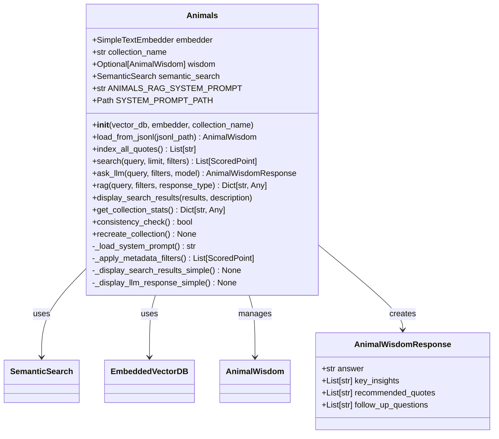

# Animals Class: Complete RAG System

## 🎯 Class Overview

The `Animals` class is the flagship component of the RAG to Riches framework - a powerful, intelligent corpus loader that combines semantic search, vector databases, and AI-powered question answering into a single, easy-to-use interface.

This class provides a complete solution for working with collections of animal quotes, offering semantic search, AI-powered question answering, and beautiful result display. Perfect for educational applications, research, or building chatbots that need access to animal wisdom and quotes.

## 📋 Class Definition

```python
class Animals:
    """A powerful, intelligent corpus loader for animal quotes with RAG capabilities."""
```

### 🏗️ Class Architecture



## 🚀 Key Features

- **Complete RAG Pipeline**: Search + LLM response in a single method call
- **Semantic Search**: Advanced sentence transformer embeddings for meaning-based retrieval
- **AI Integration**: OpenAI GPT models with structured response generation
- **Rich Display**: Beautiful formatted output with Rich library
- **Batch Operations**: Efficient handling of large quote collections
- **Metadata Filtering**: Filter by author, category, or similarity score
- **Health Monitoring**: Collection statistics and consistency checks

## 📖 Constructor

### `__init__(vector_db, embedder=None, collection_name="animals")`

Initialize your Animals quote corpus with intelligent search capabilities.

#### Parameters

| Parameter | Type | Default | Description |
|-----------|------|---------|-------------|
| `vector_db` | `EmbeddedVectorDB` | Required | Vector database instance for storage |
| `embedder` | `SimpleTextEmbedder` | `None` | Text embedding model (uses default if None) |
| `collection_name` | `str` | `"animals"` | Unique name for your quote collection |

#### Example Usage

```python
from rag_to_riches.vectordb.embedded_vectordb import EmbeddedVectorDB
from rag_to_riches.corpus.animals import Animals

# Basic setup with default embedder
vector_db = EmbeddedVectorDB()
animals = Animals(vector_db)

# Custom setup with specific collection
animals = Animals(
    vector_db=vector_db,
    collection_name="philosophical_animal_quotes"
)

# Advanced setup with custom embedder
custom_embedder = SimpleTextEmbedder(model_name="custom-model")
animals = Animals(vector_db, embedder=custom_embedder)
```

#### Design by Contract

- **Preconditions**: 
  - `vector_db` must be an `EmbeddedVectorDB` instance
  - `embedder` must be `None` or a `SimpleTextEmbedder` instance
- **Postconditions**: All required attributes are initialized

## 📥 Data Loading Methods

### `load_from_jsonl(jsonl_path)`

Load and validate animal quotes from a JSONL (JSON Lines) file.

#### Parameters

| Parameter | Type | Description |
|-----------|------|-------------|
| `jsonl_path` | `Path` | Path to JSONL file containing animal quotes |

#### Returns

`AnimalWisdom` - Validated collection of quotes ready for indexing

#### Expected JSONL Format

```json
{"text": "Dogs are not our whole life, but they make our lives whole.", "author": "Roger Caras", "category": "Pets and Companionship"}
{"text": "The greatness of a nation can be judged by the way its animals are treated.", "author": "Mahatma Gandhi", "category": "Ethics and Compassion"}
```

#### Example Usage

```python
from pathlib import Path

# Load quotes from file
quotes_path = Path("data/animal_wisdom.jsonl")
wisdom = animals.load_from_jsonl(quotes_path)

print(f"Loaded {len(wisdom)} quotes")
print(f"Categories: {wisdom.get_categories()}")
print(f"Authors: {wisdom.get_authors()}")

# Access individual quotes
for quote in wisdom.quotes[:3]:
    print(f'"{quote.text}" - {quote.author}')
```

#### Error Handling

- **`FileNotFoundError`**: When the specified file doesn't exist
- **`InvalidPointsError`**: When no valid quotes are found in the file

### `index_all_quotes()`

Transform all loaded quotes into searchable vector embeddings.

#### Returns

`List[str]` - List of unique point IDs for each indexed quote

#### Process Flow

1. Extracts text content from each quote
2. Generates semantic embeddings using the configured model
3. Stores vectors in the database with rich metadata
4. Creates searchable points for instant retrieval

#### Example Usage

```python
# Load quotes first
wisdom = animals.load_from_jsonl("quotes.jsonl")

# Index for semantic search
point_ids = animals.index_all_quotes()
print(f"Successfully indexed {len(point_ids)} quotes")

# Now you can search semantically
results = animals.search("loyalty and friendship")
```

#### Performance Notes

- Batch processing is used for efficiency with large collections
- Indexing time scales with collection size and model complexity
- Typical speed: ~100-500 quotes per second depending on hardware
- GPU acceleration automatically used if available

### `load_and_index(jsonl_path)`

One-step solution: load quotes from file and make them instantly searchable.

#### Parameters

| Parameter | Type | Description |
|-----------|------|-------------|
| `jsonl_path` | `Path` | Path to JSONL file containing animal quotes |

#### Returns

`Tuple[AnimalWisdom, List[str]]` - Loaded wisdom and point IDs

#### Example Usage

```python
# Complete setup in one line
wisdom, point_ids = animals.load_and_index("my_quotes.jsonl")

print(f"Ready to search {len(wisdom)} quotes!")

# Immediately start searching
results = animals.search("courage and bravery")
```

## 🔍 Search Methods

### `search(query, limit=10, score_threshold=None, author=None, category=None)`

Find the most relevant animal quotes using intelligent semantic search.

#### Parameters

| Parameter | Type | Default | Description |
|-----------|------|---------|-------------|
| `query` | `str` | Required | Search question or topic in natural language |
| `limit` | `int` | `10` | Maximum number of results to return |
| `score_threshold` | `float` | `None` | Minimum similarity score (0.0-1.0) |
| `author` | `str` | `None` | Filter to only include quotes by this author |
| `category` | `str` | `None` | Filter to only include quotes from this category |

#### Returns

`List[models.ScoredPoint]` - Results sorted by relevance (highest scores first)

#### Example Usage

```python
# Basic semantic search
results = animals.search("loyalty and friendship")

# Precise search with high threshold
results = animals.search(
    "courage in difficult times",
    limit=5,
    score_threshold=0.8
)

# Search within specific author's quotes
gandhi_quotes = animals.search(
    "compassion",
    author="Mahatma Gandhi",
    limit=3
)

# Browse by category
wisdom_quotes = animals.search(
    "life lessons",
    category="Wisdom and Philosophy"
)

# Process results
for result in results:
    print(f"Score: {result.score:.3f}")
    print(f"Quote: {result.payload['content']}")
    print(f"Author: {result.payload['author']}")
    print("---")
```

#### Search Tips

- Use descriptive phrases rather than single keywords
- Try different phrasings if you don't find what you're looking for
- Lower the score_threshold to see more diverse results
- Combine filters to narrow down to specific types of quotes

#### Design by Contract

- **Preconditions**:
  - `query` must be a non-empty string
  - `limit` must be a positive integer
  - `author` and `category` filters must be None or non-empty strings
- **Postconditions**: Returns a list of ScoredPoint objects

## 🤖 AI Integration Methods

### `ask_llm(user_query, limit=5, score_threshold=None, author=None, category=None, model="gpt-4o")`

Ask AI thoughtful questions about animals and get structured, insightful answers.

#### Parameters

| Parameter | Type | Default | Description |
|-----------|------|---------|-------------|
| `user_query` | `str` | Required | Your question about animals |
| `limit` | `int` | `5` | Number of relevant quotes to provide as context |
| `score_threshold` | `float` | `None` | Only use quotes above this similarity score |
| `author` | `str` | `None` | Focus on quotes from this specific author |
| `category` | `str` | `None` | Limit context to quotes from this category |
| `model` | `str` | `"gpt-4o"` | OpenAI model to use |

#### Returns

`AnimalWisdomResponse` - Structured response containing:
- `answer`: Comprehensive, thoughtful response
- `key_insights`: 2-5 main themes or takeaways
- `recommended_quotes`: Most relevant quotes with attribution
- `follow_up_questions`: Suggested related questions

#### Example Usage

```python
# Ask a philosophical question
response = animals.ask_llm(
    "What can animals teach us about resilience and survival?"
)

# Display the structured response
animals.display_llm_response(response, "resilience question")

# Access specific parts
print("Main Answer:")
print(response.answer)

print("\nKey Insights:")
for insight in response.key_insights:
    print(f"- {insight}")

# Ask follow-up questions
for question in response.follow_up_questions:
    print(f"Next: {question}")
```

#### Question Ideas

- "How do animals demonstrate unconditional love?"
- "What survival strategies can humans learn from animals?"
- "How do different cultures view human-animal relationships?"
- "What role do animals play in teaching empathy?"

### `ask_llm_simple(user_query, limit=3, model="gpt-4o")`

Get a simple text response from the LLM about animals.

#### Parameters

| Parameter | Type | Default | Description |
|-----------|------|---------|-------------|
| `user_query` | `str` | Required | Your question about animals |
| `limit` | `int` | `3` | Maximum number of search results to include |
| `model` | `str` | `"gpt-4o"` | OpenAI model to use |

#### Returns

`str` - Simple text response from the LLM

### `rag(user_query, limit=5, score_threshold=None, author=None, category=None, model="gpt-4o", response_type="structured")`

🚀 Complete AI-powered question answering in one powerful method call.

This is your one-stop solution for getting intelligent answers about animals. It automatically searches your quote collection, finds the most relevant content, and generates comprehensive AI responses with full transparency into the process.

#### The Complete RAG Pipeline

1. 🔍 Semantic search finds relevant quotes from your collection
2. 📝 Context generation creates optimized prompts for the AI
3. 🤖 AI reasoning produces thoughtful, grounded responses
4. 📊 Full transparency with all intermediate results returned

#### Parameters

| Parameter | Type | Default | Description |
|-----------|------|---------|-------------|
| `user_query` | `str` | Required | Your question about animals |
| `limit` | `int` | `5` | Number of quotes to use as context |
| `score_threshold` | `float` | `None` | Minimum relevance score for quotes |
| `author` | `str` | `None` | Limit context to quotes from this author |
| `category` | `str` | `None` | Focus on quotes from this category |
| `model` | `str` | `"gpt-4o"` | OpenAI model for AI responses |
| `response_type` | `str` | `"structured"` | "structured" or "simple" response format |

#### Returns

`Dict[str, Any]` - Complete results dictionary containing:
- `llm_response`: AI answer (structured object or simple string)
- `search_results`: List of relevant quotes found (with scores)
- `rag_context`: Full prompt sent to AI (for debugging/transparency)
- `query_info`: Metadata about the query and processing parameters

#### Example Usage

```python
# Complete RAG in one call
result = animals.rag(
    "What do animals teach us about unconditional love?",
    limit=7,
    score_threshold=0.6,
    response_type="structured"
)

# Access the AI response
ai_answer = result["llm_response"]
print("AI Answer:", ai_answer.answer)

# See what quotes were used
quotes_used = result["search_results"]
print(f"Based on {len(quotes_used)} relevant quotes")

# Inspect the full context (for debugging)
full_prompt = result["rag_context"]

# Get query metadata
info = result["query_info"]
print(f"Model: {info['model']}, Results: {info['results_count']}")
```

#### Advanced Usage

```python
# Domain-specific question
ethics_result = animals.rag(
    "How should humans treat wild animals?",
    category="Ethics and Compassion",
    limit=10
)

# Author-focused inquiry
gandhi_result = animals.rag(
    "What did Gandhi believe about animals?",
    author="Mahatma Gandhi",
    response_type="simple"
)
```

## 🎨 Display Methods

### `display_search_results(results, search_description, max_text_length=120)`

Present search results in a beautiful, easy-to-read table format.

#### Parameters

| Parameter | Type | Default | Description |
|-----------|------|---------|-------------|
| `results` | `List[models.ScoredPoint]` | Required | Search results to display |
| `search_description` | `str` | Required | Descriptive title for the search |
| `max_text_length` | `int` | `120` | Maximum characters before truncation |

#### Features

- 🎨 Color-coded columns for easy scanning
- 📊 Relevance scores prominently displayed
- ✂️ Smart text truncation to maintain readability
- 📱 Responsive layout that works in various terminal sizes
- 🚫 Graceful handling of empty results

#### Example Usage

```python
# Search and display results beautifully
results = animals.search("courage and bravery", limit=5)
animals.display_search_results(
    results, 
    "Quotes about Courage and Bravery",
    max_text_length=100
)
```

### `display_llm_response(response, user_query)`

Display the LLM response in a formatted way using Rich.

#### Parameters

| Parameter | Type | Description |
|-----------|------|-------------|
| `response` | `AnimalWisdomResponse` | Structured response from the LLM |
| `user_query` | `str` | Original user query |

#### Features

- 🤖 Main answer in highlighted panel
- 💡 Key insights in organized list
- 📚 Recommended quotes with attribution
- 🔍 Follow-up questions for continued exploration

## 📊 Management Methods

### `get_collection_stats()`

Get comprehensive statistics and insights about your quote collection.

#### Returns

`Dict[str, Any]` - Dictionary containing detailed statistics:
- `collection_name`: Name of your quote collection
- `collection_exists`: Whether the database collection exists
- `point_count`: Total quotes stored in the database
- `loaded_quotes`: Number of quotes currently loaded in memory
- `categories`: List of all unique quote categories (sorted)
- `authors`: List of all unique authors (sorted)

#### Example Usage

```python
stats = animals.get_collection_stats()

print(f"Collection: {stats['collection_name']}")
print(f"Total quotes in database: {stats['point_count']}")
print(f"Quotes loaded in memory: {stats['loaded_quotes']}")
print(f"Categories ({len(stats['categories'])}): {stats['categories']}")
print(f"Authors ({len(stats['authors'])}): {stats['authors'][:5]}...")

# Check if ready for search
if stats['collection_exists'] and stats['point_count'] > 0:
    print("✅ Ready for semantic search!")
else:
    print("❌ Need to load and index quotes first")
```

### `consistency_check()`

Verify that your database collection is properly configured and ready to use.

#### Returns

`bool` - True if everything is properly configured, False if issues detected

#### What's Checked

- Vector dimensions match between collection and embedder
- Distance metric compatibility
- Collection existence and accessibility
- Basic connectivity to the vector database

#### Example Usage

```python
if animals.consistency_check():
    print("✅ Collection is healthy and ready!")
    results = animals.search("your query here")
else:
    print("❌ Configuration issues detected")
    print("Consider recreating the collection:")
    animals.recreate_collection()
```

### `recreate_collection()`

Completely reset your quote collection with a fresh, empty database.

#### Process

1. Safely deletes the existing collection if it exists
2. Creates a new empty collection with optimal settings
3. Clears all loaded quote data from memory
4. Prepares the system for fresh data loading

#### Example Usage

```python
# Reset everything and start fresh
animals.recreate_collection()

# Now load new data
new_wisdom = animals.load_from_jsonl("updated_quotes.jsonl")
animals.index_all_quotes()
```

#### ⚠️ Warning

This operation is irreversible! All existing quotes in the collection will be permanently deleted. Make sure you have backups of important data before calling this method.

## 🔧 RAG Helper Methods

### `format_search_results_for_rag(search_results, max_results=5)`

Format search results for RAG system prompt.

#### Parameters

| Parameter | Type | Default | Description |
|-----------|------|---------|-------------|
| `search_results` | `List[models.ScoredPoint]` | Required | Search results to format |
| `max_results` | `int` | `5` | Maximum number of results to include |

#### Returns

`str` - Formatted string for RAG context

### `create_rag_context(user_query, search_results, system_prompt=None)`

Create a complete RAG context with system prompt and formatted results.

#### Parameters

| Parameter | Type | Default | Description |
|-----------|------|---------|-------------|
| `user_query` | `str` | Required | The user's question |
| `search_results` | `List[models.ScoredPoint]` | Required | Search results |
| `system_prompt` | `str` | `None` | System prompt (uses default if None) |

#### Returns

`str` - Complete RAG context string

### `search_and_create_rag_context(user_query, limit=5, **kwargs)`

Search for quotes and create RAG context in one convenient method.

#### Parameters

Combines parameters from `search()` and `create_rag_context()` methods.

#### Returns

`str` - Complete RAG context string

## 🔒 Private Methods

### `_load_system_prompt()`

Load the AI system prompt from external configuration file.

#### Returns

`str` - The system prompt text for RAG operations, or empty string if unavailable

### `_apply_metadata_filters(results, author_filter=None, category_filter=None)`

Apply author and/or category filters to search results.

#### Parameters

| Parameter | Type | Default | Description |
|-----------|------|---------|-------------|
| `results` | `List[models.ScoredPoint]` | Required | List of scored points from vector search |
| `author_filter` | `str` | `None` | Optional author name to filter by |
| `category_filter` | `str` | `None` | Optional category name to filter by |

#### Returns

`List[models.ScoredPoint]` - Filtered list of scored points

### `_display_search_results_simple(results, search_description, max_text_length)`

Simple fallback display method when Rich library is not available.

### `_display_llm_response_simple(response, user_query)`

Simple fallback display method for LLM responses when Rich is not available.

## 📝 Class Attributes

### `SYSTEM_PROMPT_PATH`

`Path` - Path to the external system prompt file for RAG operations.

Default: `Path(__file__).parent / "prompts" / "animals_system_prompt.md"`

### `ANIMALS_RAG_SYSTEM_PROMPT`

`str` - Comprehensive RAG system prompt for Animals class (loaded at init time).

### `SIMPLE_ANIMALS_PROMPT`

`str` - Alternative shorter version for quick use:

```python
SIMPLE_ANIMALS_PROMPT = """
You are an expert on animal wisdom and quotes. Use the provided search results 
to answer questions about animals, human-animal relationships, and life lessons. 
Always attribute quotes to their authors and explain their relevance to the user's question. 
Be conversational, thoughtful, and helpful in connecting users with the wisdom 
found in animal quotes throughout history.
"""
```

## 🎯 Use Cases

- **Educational Chatbots**: AI tutors with grounded animal knowledge
- **Research Tools**: Explore themes in animal-related literature
- **Content Generation**: Source-backed articles and presentations
- **Interactive Learning**: Question-answer systems for students
- **Philosophical Exploration**: Deep dives into animal wisdom and ethics

## 🔗 Dependencies

The Animals class integrates with several other framework components:

- **`SemanticSearch`**: Core search functionality
- **`EmbeddedVectorDB`**: Vector storage and retrieval
- **`SimpleTextEmbedder`**: Text embedding generation
- **`AnimalQuote`** and **`AnimalWisdom`**: Data models
- **OpenAI**: LLM integration via instructor
- **Rich**: Beautiful terminal output
- **Loguru**: Comprehensive logging

## 📚 Source Code

::: rag_to_riches.corpus.animals.Animals
    options:
      show_source: true
      show_root_heading: true
      show_root_toc_entry: true

---

*The Animals class represents the culmination of modern RAG system design - combining semantic search, AI reasoning, and beautiful presentation into a single, powerful interface. Perfect for building production-ready applications that need intelligent, grounded responses about animal wisdom and knowledge.* 