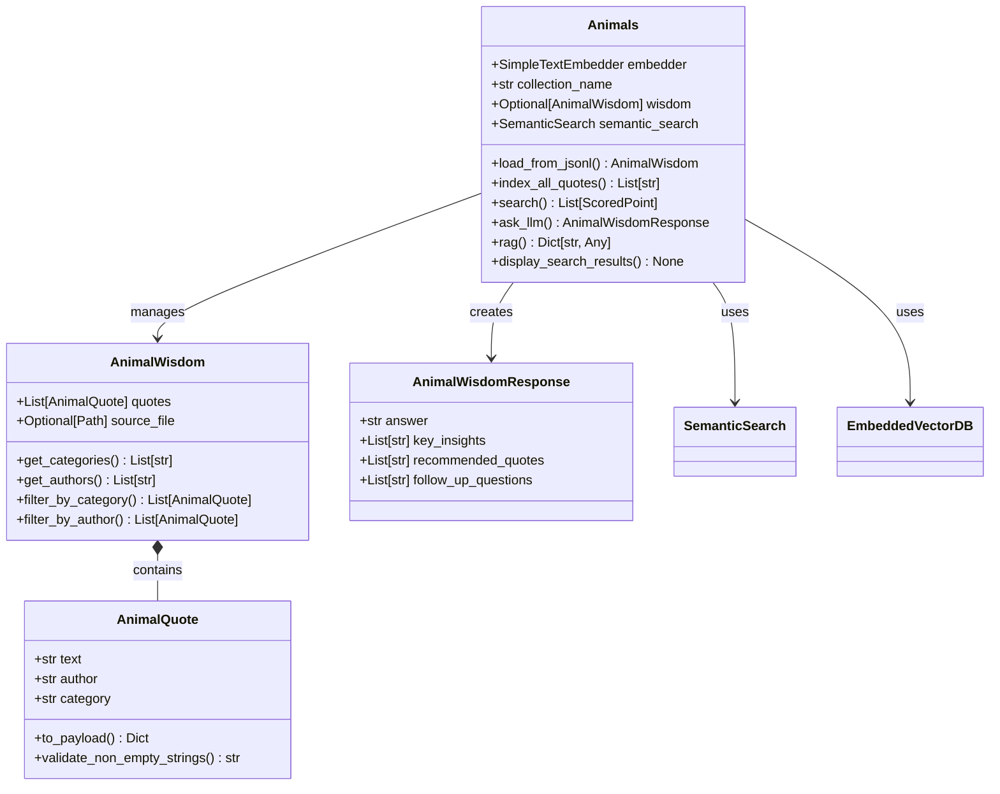
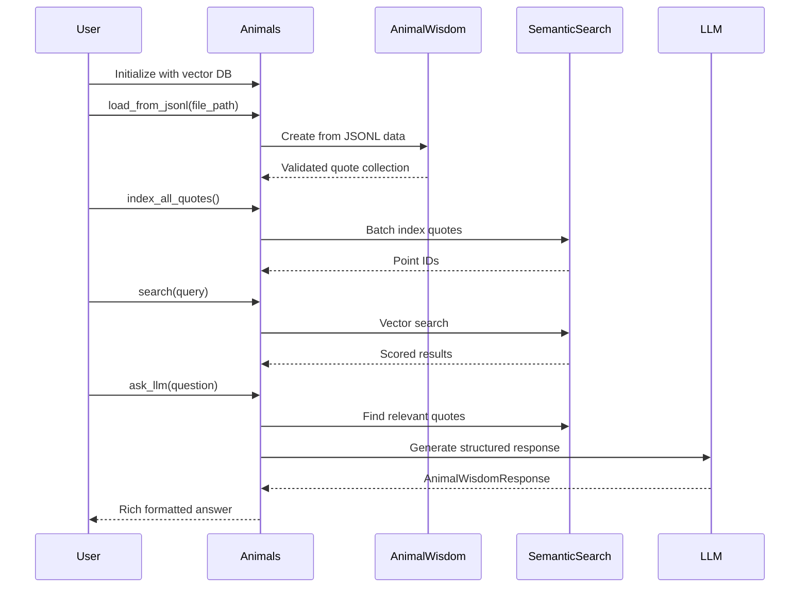

# Corpus Package: Data Models and Content Management

## 📖 Package Overview

The `corpus` package is the heart of content management in the RAG to Riches framework. It provides sophisticated data models, corpus loading capabilities, and intelligent question-answering systems built on top of semantic search and large language models.

### 🎯 Package Purpose

This package transforms raw text data into intelligent, searchable knowledge bases with AI-powered query capabilities. It handles the complete pipeline from data validation to AI-powered responses, making it easy to build production-ready RAG applications.

### 🏗️ Architecture



### 📦 Components

#### 🏛️ Core Components

| Component | File | Purpose |
|-----------|------|---------|
| [`Animals`](Animals.md) | `animals.py` | Main RAG system with search and AI capabilities |
| [`AnimalQuote`](AnimalQuote.md) | `data_models.py` | Individual quote with metadata |
| [`AnimalWisdom`](AnimalWisdom.md) | `data_models.py` | Collection of validated quotes |

#### 🤖 AI Integration

| Component | Purpose | Key Features |
|-----------|---------|--------------|
| `AnimalWisdomResponse` | Structured AI responses | Insights, quotes, follow-ups |
| RAG System Prompts | AI instruction templates | Optimized for animal wisdom |
| LLM Integration | OpenAI GPT integration | Structured response generation |

### 🔄 Typical Usage Flow



### 💡 Key Features

#### 🔍 Intelligent Search
- **Semantic Understanding**: Goes beyond keyword matching to understand meaning
- **Metadata Filtering**: Filter by author, category, or relevance score
- **Batch Processing**: Efficient handling of large quote collections
- **Rich Display**: Beautiful formatted results with the Rich library

#### 🤖 AI-Powered Responses
- **Structured Outputs**: Organized answers with insights and recommendations
- **Source Attribution**: All responses grounded in your quote collection
- **Follow-up Questions**: Suggested related queries for deeper exploration
- **Multiple Response Types**: Structured objects or simple text responses

#### 📊 Data Management
- **Validation**: Comprehensive data validation using Pydantic
- **Statistics**: Collection analytics and health monitoring
- **Consistency Checks**: Verify database and embedder compatibility
- **Error Handling**: Detailed error messages with suggested solutions

### 🚀 Quick Start Example

```python
from pathlib import Path
from rag_to_riches.vectordb.embedded_vectordb import EmbeddedVectorDB
from rag_to_riches.corpus.animals import Animals

# Initialize the system
vector_db = EmbeddedVectorDB()
animals = Animals(vector_db, collection_name="wisdom_quotes")

# Load your data
quotes_file = Path("data/animal_wisdom.jsonl")
wisdom = animals.load_from_jsonl(quotes_file)
print(f"Loaded {len(wisdom)} quotes")

# Index for search
point_ids = animals.index_all_quotes()
print(f"Indexed {len(point_ids)} quotes")

# Search semantically
results = animals.search("courage and bravery", limit=5)
animals.display_search_results(results, "Courage Quotes")

# Get AI insights
response = animals.ask_llm("What can animals teach us about resilience?")
animals.display_llm_response(response, "resilience question")

# Complete RAG pipeline
rag_result = animals.rag(
    "How do pets help with emotional healing?",
    limit=7,
    response_type="structured"
)
```

### 📁 Data Format

The corpus expects JSONL (JSON Lines) format with this structure:

```json
{"text": "Dogs are not our whole life, but they make our lives whole.", "author": "Roger Caras", "category": "Pets and Companionship"}
{"text": "The greatness of a nation can be judged by the way its animals are treated.", "author": "Mahatma Gandhi", "category": "Ethics and Compassion"}
```

**Required Fields:**
- `text`: The quote content (non-empty string)
- `author`: Attribution (non-empty string)  
- `category`: Thematic classification (non-empty string)

### 🛠️ Advanced Configuration

#### Custom System Prompts
The AI responses can be customized using external prompt files:

```python
# Custom prompt location
Animals.SYSTEM_PROMPT_PATH = Path("my_prompts/custom_animal_prompt.md")

# Or use the simple built-in prompt
animals.ask_llm(query, system_prompt=Animals.SIMPLE_ANIMALS_PROMPT)
```

#### Performance Tuning
```python
# Optimize for large collections
animals = Animals(
    vector_db=vector_db,
    collection_name="large_corpus",
    embedder=SimpleTextEmbedder(model_name="sentence-transformers/all-mpnet-base-v2")
)

# Batch operations for efficiency
wisdom, point_ids = animals.load_and_index(large_file)

# Filtered searches for precision
results = animals.search(
    "animal behavior",
    limit=10,
    score_threshold=0.8,
    category="Scientific Research"
)
```

### 🔗 Integration with Other Packages

The corpus package seamlessly integrates with other framework components:

- **[Vector Database](../vectordb/index.md)**: Persistent storage and retrieval
- **[Search](../search/index.md)**: Semantic similarity matching  
- **[Exceptions](../exceptions/index.md)**: Comprehensive error handling
- **[Utils](../utils/index.md)**: Logging and configuration

### 📚 Detailed Documentation

- **[Animals Class](Animals.md)**: Complete RAG system documentation
- **[AnimalQuote Class](AnimalQuote.md)**: Individual quote data model
- **[AnimalWisdom Class](AnimalWisdom.md)**: Quote collection management

### 🎯 Use Cases

- **Educational Chatbots**: AI tutors with grounded animal knowledge
- **Research Tools**: Explore themes in animal-related literature
- **Content Generation**: Source-backed articles and presentations
- **Interactive Learning**: Question-answer systems for students
- **Philosophical Exploration**: Deep dives into animal wisdom and ethics

---

*The corpus package transforms static text into intelligent, interactive knowledge systems. Perfect for building educational tools, research applications, and AI-powered content systems.* 