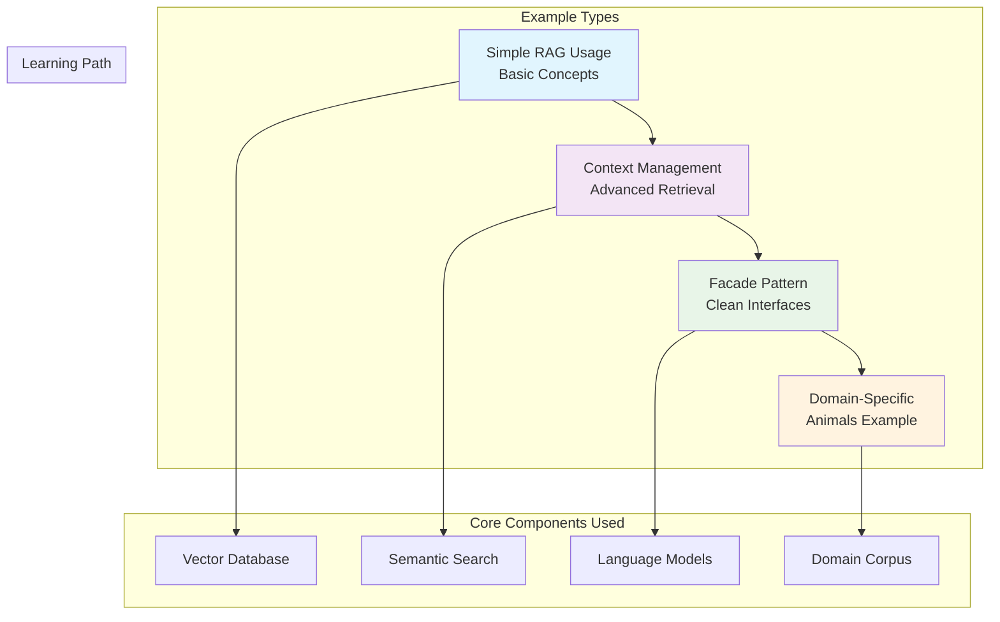

# Examples Package

## Overview

The `examples` package provides comprehensive, real-world demonstrations of the RAG to Riches framework. This package contains complete, runnable examples that showcase different aspects of building production-ready RAG systems, from simple usage patterns to advanced implementations.

## Key Components

### Simple RAG Usage

**File**: `simple_rag_usage.py`

A straightforward demonstration of basic RAG functionality, perfect for understanding core concepts and getting started quickly.

### RAG Context Demo

**File**: `rag_context_demo.py`

An advanced example showing how to manage and optimize context in RAG systems, including context windowing, relevance filtering, and context assembly strategies.

### RAG Facade Demo

**File**: `rag_facade_demo.py`

A comprehensive demonstration of the Facade pattern implementation, showing how to create simplified interfaces for complex RAG pipelines.

### RAG with Animals Example

**File**: `rag_with_animals_example.py`

A complete, domain-specific example using the animal quotes corpus, demonstrating how to build specialized RAG systems for particular domains.

## Architecture



## Getting Started

### Running the Examples

All examples are designed to be runnable out-of-the-box with minimal setup:

```bash
# Navigate to the project root
cd rag_to_riches

# Run simple RAG example
python src/rag_to_riches/examples/simple_rag_usage.py

# Run context management demo
python src/rag_to_riches/examples/rag_context_demo.py

# Run facade pattern demo
python src/rag_to_riches/examples/rag_facade_demo.py

# Run animals domain example
python src/rag_to_riches/examples/rag_with_animals_example.py
```

### Prerequisites

Ensure you have the required environment setup:

```bash
# Install dependencies
uv sync

# Set up environment variables (copy from sample.env)
cp sample.env .env
# Edit .env with your API keys

# Verify setup
python -c "from rag_to_riches import __version__; print(f'RAG to Riches v{__version__}')"
```

## Example Walkthroughs

### Simple RAG Usage Example

This example demonstrates the most basic RAG pipeline:

```python
from rag_to_riches.start_simply.basic_rag import BasicRAG
from pathlib import Path

def main():
    """Simple demonstration of RAG functionality."""
    
    # Initialize RAG system
    rag = BasicRAG(collection_name="simple_demo")
    
    # Sample documents
    documents = [
        "The Earth orbits around the Sun in approximately 365.25 days.",
        "Python is a high-level programming language known for its simplicity.",
        "Machine learning algorithms can identify patterns in large datasets.",
        "The human brain contains approximately 86 billion neurons."
    ]
    
    # Add documents to the system
    print("📚 Indexing documents...")
    rag.add_documents(documents)
    print(f"✅ Indexed {len(documents)} documents")
    
    # Perform searches and generate answers
    queries = [
        "How long does Earth take to orbit the Sun?",
        "What programming language is known for simplicity?",
        "How many neurons are in the human brain?"
    ]
    
    for query in queries:
        print(f"\n❓ Query: {query}")
        answer = rag.ask(query)
        print(f"💡 Answer: {answer}")

if __name__ == "__main__":
    main()
```

**Key Learning Points:**
- Basic RAG initialization
- Document indexing workflow  
- Simple query-answer pattern
- Understanding retrieval + generation

### Context Management Demo

This advanced example shows sophisticated context handling:

```python
from rag_to_riches.search.semantic_search import SemanticSearch
from rag_to_riches.vectordb.embedded_vectordb import EmbeddedVectorDB
import openai

def demonstrate_context_management():
    """Advanced context management techniques."""
    
    # Initialize components
    vector_db = EmbeddedVectorDB()
    search_engine = SemanticSearch(vector_db, collection_name="context_demo")
    
    # Load extensive document collection
    documents = load_large_document_collection()  # Your loading function
    search_engine.index_documents(documents)
    
    # Context optimization strategies
    def optimize_context(query: str, max_tokens: int = 2000):
        """Demonstrate context optimization techniques."""
        
        # Strategy 1: Relevance-based filtering
        initial_results = search_engine.search(query, limit=20)
        high_relevance = [r for r in initial_results if r['score'] > 0.7]
        
        # Strategy 2: Diversity sampling
        diverse_results = select_diverse_documents(high_relevance)
        
        # Strategy 3: Token-aware assembly
        context = assemble_context_within_limits(diverse_results, max_tokens)
        
        return context
    
    # Demonstrate different context strategies
    query = "What are the environmental impacts of renewable energy?"
    
    # Basic context
    basic_context = search_engine.search(query, limit=3)
    print("📄 Basic context (3 documents):")
    display_context(basic_context)
    
    # Optimized context
    optimized_context = optimize_context(query)
    print("\n🎯 Optimized context:")
    display_context(optimized_context)
    
    # Generate answers with different contexts
    basic_answer = generate_answer(query, basic_context)
    optimized_answer = generate_answer(query, optimized_context)
    
    print(f"\n💡 Basic Answer: {basic_answer}")
    print(f"🚀 Optimized Answer: {optimized_answer}")
```

**Key Learning Points:**
- Context relevance filtering
- Document diversity sampling
- Token-aware context assembly
- Comparing context strategies

### Facade Pattern Demo

Shows how to create clean, simple interfaces for complex RAG systems:

```python
from rag_to_riches.corpus.animals import Animals
from rag_to_riches.vectordb.embedded_vectordb import EmbeddedVectorDB

class RAGFacade:
    """Simplified interface for complex RAG operations."""
    
    def __init__(self, domain: str = "general"):
        """Initialize RAG system for specific domain."""
        self.vector_db = EmbeddedVectorDB()
        
        if domain == "animals":
            self.corpus = Animals(self.vector_db, collection_name="animals_facade")
        else:
            # Initialize general-purpose corpus
            self.corpus = self._initialize_general_corpus()
    
    def quick_setup(self, data_source: str):
        """One-line setup for RAG system."""
        print("🔧 Setting up RAG system...")
        
        # Automatic data loading and indexing
        if data_source.endswith('.jsonl'):
            self.corpus.load_and_index(Path(data_source))
        elif data_source.endswith('.txt'):
            self._load_text_file(data_source)
        else:
            raise ValueError(f"Unsupported data source: {data_source}")
        
        print("✅ RAG system ready!")
    
    def ask(self, question: str) -> str:
        """Simple question-answering interface."""
        return self.corpus.rag(question, response_type="conversational")
    
    def explore(self, topic: str, num_examples: int = 3):
        """Explore a topic with examples."""
        results = self.corpus.search(topic, limit=num_examples)
        self.corpus.display_search_results(results, f"Exploring: {topic}")
        return results
    
    def get_insights(self, query: str) -> dict:
        """Get structured insights about a query."""
        return self.corpus.rag(query, response_type="structured")

def main():
    """Demonstrate the facade pattern."""
    
    # One-line setup
    rag = RAGFacade(domain="animals")
    rag.quick_setup("data/corpus/animals/animals.jsonl")
    
    # Simple interactions
    answer = rag.ask("What do elephants teach us about memory?")
    print(f"💡 {answer}")
    
    # Topic exploration
    examples = rag.explore("wisdom about friendship")
    
    # Structured insights
    insights = rag.get_insights("How do animals show courage?")
    print(f"🧠 Insights: {insights}")

if __name__ == "__main__":
    main()
```

**Key Learning Points:**
- Facade pattern implementation
- Simplified API design
- Domain-specific customization
- Progressive feature exposure

### Animals Domain Example

Complete domain-specific implementation using the animal quotes corpus:

```python
from rag_to_riches.corpus.animals import Animals
from rag_to_riches.vectordb.embedded_vectordb import EmbeddedVectorDB
from pathlib import Path
import rich

def build_animal_wisdom_assistant():
    """Build a specialized assistant for animal wisdom."""
    
    # Initialize components
    vector_db = EmbeddedVectorDB()
    animals = Animals(vector_db, collection_name="wisdom_assistant")
    
    # Load the animal quotes corpus
    quotes_file = Path("data/corpus/animals/animals.jsonl")
    print("📖 Loading animal wisdom corpus...")
    
    wisdom_data, point_ids = animals.load_and_index(quotes_file)
    print(f"✅ Loaded {len(wisdom_data)} pieces of animal wisdom")
    
    # Display corpus statistics
    animals.display_collection_info()
    
    return animals

def interactive_wisdom_session(animals: Animals):
    """Interactive session for exploring animal wisdom."""
    
    print("\n🐾 Welcome to the Animal Wisdom Assistant!")
    print("Ask questions about what animals can teach us.\n")
    
    sample_queries = [
        "What do cats teach us about independence?",
        "How do wolves demonstrate leadership?",
        "What wisdom do elephants offer about memory?",
        "How do birds inspire us about freedom?",
        "What can dogs teach us about loyalty?"
    ]
    
    print("💡 Try these example questions:")
    for i, query in enumerate(sample_queries, 1):
        print(f"  {i}. {query}")
    print()
    
    while True:
        user_query = input("🤔 Your question (or 'quit' to exit): ").strip()
        
        if user_query.lower() in ['quit', 'exit', 'q']:
            print("👋 Thank you for exploring animal wisdom!")
            break
        
        if not user_query:
            continue
        
        # Perform RAG query
        print(f"\n🔍 Searching for wisdom about: {user_query}")
        
        # Show retrieved context
        search_results = animals.search(user_query, limit=3)
        animals.display_search_results(search_results, "Relevant Wisdom")
        
        # Generate AI response
        response = animals.ask_llm(user_query)
        animals.display_llm_response(response, user_query)
        
        print("\n" + "="*60 + "\n")

def demonstrate_advanced_features(animals: Animals):
    """Show advanced features of the animals corpus."""
    
    print("🚀 Advanced Features Demonstration\n")
    
    # 1. Structured responses
    print("1️⃣ Structured Response:")
    structured = animals.rag(
        "What are the key lessons about courage from animals?",
        response_type="structured"
    )
    rich.print(structured)
    
    # 2. Batch processing
    print("\n2️⃣ Batch Processing:")
    questions = [
        "wisdom about patience",
        "lessons about courage", 
        "teachings about friendship"
    ]
    
    for question in questions:
        results = animals.search(question, limit=2)
        print(f"📝 {question.title()}: {len(results)} results found")
    
    # 3. Metadata filtering (if available)
    print("\n3️⃣ Filtering by Animal Type:")
    cat_wisdom = animals.search(
        "independence and self-reliance",
        limit=5,
        metadata_filter={"animal_type": "cat"}  # If this field exists
    )
    
    if cat_wisdom:
        print(f"🐱 Found {len(cat_wisdom)} cat-specific wisdom quotes")
    
    # 4. Context analysis
    print("\n4️⃣ Context Analysis:")
    analysis = animals.analyze_corpus_themes()
    if analysis:
        print(f"📊 Main themes: {', '.join(analysis.get('themes', []))}")

def main():
    """Main execution function."""
    
    try:
        # Build the assistant
        animals = build_animal_wisdom_assistant()
        
        # Demonstrate features
        demonstrate_advanced_features(animals)
        
        # Interactive session
        interactive_wisdom_session(animals)
        
    except Exception as e:
        print(f"❌ Error: {e}")
        print("Make sure you have the animal quotes data file and API keys configured.")

if __name__ == "__main__":
    main()
```

**Key Learning Points:**
- Domain-specific corpus usage
- Interactive RAG applications
- Advanced feature demonstration
- Production-ready error handling

## Example Categories

### 📚 Educational Examples

Perfect for learning and understanding concepts:

- **simple_rag_usage.py**: Basic concepts and workflow
- **context_management_basics.py**: Understanding retrieval
- **generation_patterns.py**: LLM integration patterns

### 🏗️ Architectural Examples

Demonstrate design patterns and architecture:

- **rag_facade_demo.py**: Facade pattern implementation
- **component_integration.py**: How components work together
- **scalability_patterns.py**: Building for scale

### 🎯 Domain-Specific Examples

Real-world, specialized applications:

- **rag_with_animals_example.py**: Animal wisdom domain
- **legal_document_rag.py**: Legal document analysis
- **technical_documentation_rag.py**: Technical support system

### ⚡ Performance Examples

Optimization and production readiness:

- **batch_processing_demo.py**: Efficient batch operations
- **caching_strategies.py**: Performance optimization
- **memory_management.py**: Resource optimization

## Usage Patterns

### Development Workflow

1. **Start Simple**: Begin with `simple_rag_usage.py`
2. **Add Complexity**: Move to context and facade examples  
3. **Specialize**: Adapt patterns for your domain
4. **Optimize**: Apply performance examples for production

### Customization Guide

Each example includes customization points:

```python
# Configuration customization
CONFIG = {
    'model_name': 'gpt-4',  # Change LLM model
    'embedding_model': 'all-MiniLM-L6-v2',  # Change embeddings
    'collection_name': 'my_custom_collection',  # Custom collection
    'max_context_length': 2000,  # Adjust context size
    'temperature': 0.7  # Control creativity
}

# Data source customization
DATA_SOURCES = {
    'jsonl_files': ['my_data.jsonl'],
    'text_files': ['documents.txt'],
    'directories': [Path('my_docs/')],
    'apis': ['custom_api_endpoint']
}

# Feature customization
FEATURES = {
    'enable_caching': True,
    'use_metadata_filtering': True,
    'enable_batch_processing': True,
    'rich_display': True
}
```

### Integration Patterns

Examples show how to integrate with existing systems:

```python
# Web application integration
from flask import Flask, request, jsonify

app = Flask(__name__)
rag_system = initialize_rag_from_example()

@app.route('/ask', methods=['POST'])
def ask_question():
    query = request.json.get('question')
    answer = rag_system.ask(query)
    return jsonify({'answer': answer})

# API service integration
import fastapi

app = fastapi.FastAPI()
rag_facade = RAGFacade.from_example_config()

@app.post("/query")
async def process_query(query: str):
    return await rag_facade.async_ask(query)

# Batch processing integration
from celery import Celery

celery_app = Celery('rag_worker')

@celery_app.task
def process_document_batch(documents):
    return batch_process_example(documents)
```

## Troubleshooting Examples

### Common Issues and Solutions

Each example includes error handling and troubleshooting:

```python
def safe_example_execution():
    """Example with comprehensive error handling."""
    
    try:
        # Initialize RAG system
        rag = setup_rag_system()
        
    except ImportError as e:
        print(f"❌ Missing dependency: {e}")
        print("💡 Run: uv sync")
        return
    
    except FileNotFoundError as e:
        print(f"❌ Data file not found: {e}")
        print("💡 Check data/ directory and file paths")
        return
    
    except Exception as e:
        print(f"❌ Setup error: {e}")
        print("💡 Check your .env file and API keys")
        return
    
    # Continue with example...
```

### Performance Debugging

Examples include performance monitoring:

```python
import time
from contextlib import contextmanager

@contextmanager
def timing_context(operation_name):
    """Time operations for performance analysis."""
    start = time.time()
    yield
    duration = time.time() - start
    print(f"⏱️ {operation_name}: {duration:.2f}s")

# Usage in examples
with timing_context("Document indexing"):
    rag.index_documents(documents)

with timing_context("Search query"):
    results = rag.search(query)
```

## Related Components

- [`start_simply/`](../start_simply/index.md): Basic RAG implementation used in examples
- [`corpus/`](../corpus/index.md): Domain-specific corpus used in animal examples
- [`search/`](../search/index.md): Advanced search features demonstrated
- [`vectordb/`](../vectordb/index.md): Vector database operations shown in examples

---

*Part of the RAG to Riches framework - learn by example, build with confidence.* 