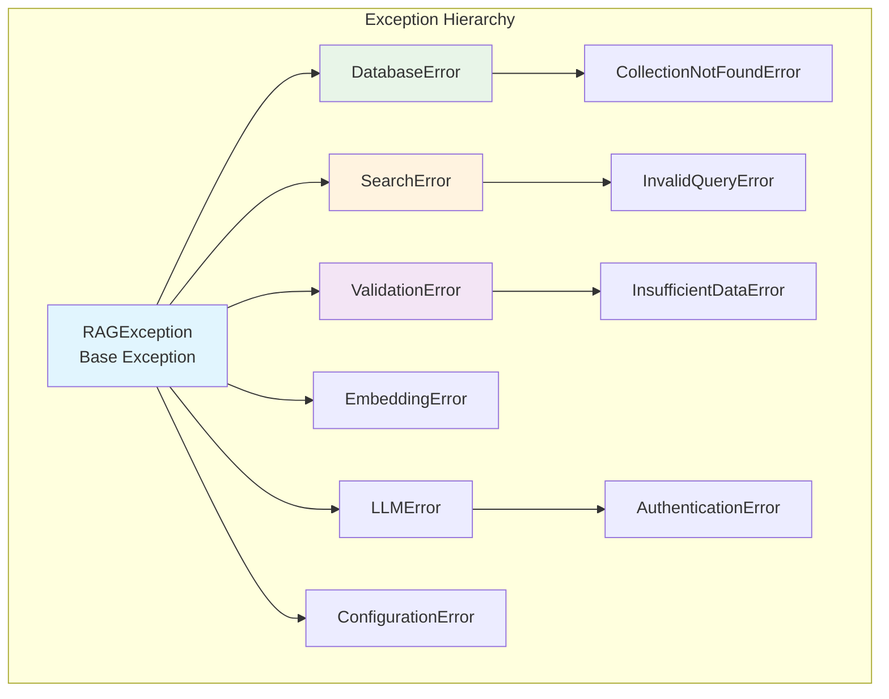

# Exceptions Package

## Overview

The `exceptions` package provides a comprehensive, hierarchical exception system for the RAG to Riches framework. This package implements custom exceptions that provide clear, actionable error messages and enable robust error handling throughout the application.

## Key Components

### Exception Hierarchy

**File**: `exceptions.py`

The exceptions package defines a well-structured hierarchy of custom exceptions that help identify and handle different types of errors that can occur during RAG operations.

#### Base Exception Classes

- **`RAGException`**: Base exception for all RAG-related errors
- **`ValidationError`**: For input validation failures
- **`DatabaseError`**: For vector database operation failures
- **`SearchError`**: For semantic search operation failures
- **`EmbeddingError`**: For text embedding operation failures
- **`LLMError`**: For language model interaction failures

#### Specialized Exception Classes

- **`CollectionNotFoundError`**: When a vector collection doesn't exist
- **`InvalidQueryError`**: For malformed or invalid search queries
- **`InsufficientDataError`**: When not enough data is available for operations
- **`ConfigurationError`**: For configuration and setup issues
- **`AuthenticationError`**: For API key and authentication failures

## Architecture



## Features

### Design by Contract Integration

The exceptions package integrates seamlessly with the project's Design-by-Contract approach:

- **Pre-condition Violations**: Clear exceptions when input requirements aren't met
- **Post-condition Failures**: Exceptions when expected outputs can't be generated
- **Invariant Violations**: Exceptions when object state becomes invalid
- **Fail-Fast Behavior**: Immediate exception raising prevents error propagation

### Rich Error Information

Each exception provides comprehensive error context:

- **Descriptive Messages**: Clear, human-readable error descriptions
- **Error Codes**: Structured error identification for programmatic handling
- **Context Data**: Relevant data and state information when the error occurred
- **Suggestions**: Actionable recommendations for resolving the issue

### Exception Chaining

Proper exception chaining preserves the full error context:

```python
try:
    # Some vector database operation
    result = vector_db.search(query)
except QdrantError as e:
    raise DatabaseError("Vector search failed") from e
```

## Usage Examples

### Basic Exception Handling

```python
from rag_to_riches.exceptions import (
    RAGException, 
    CollectionNotFoundError,
    InvalidQueryError
)

try:
    # Perform RAG operations
    results = animals.search("some query")
except CollectionNotFoundError as e:
    print(f"Collection setup required: {e}")
    # Handle collection creation
except InvalidQueryError as e:
    print(f"Query validation failed: {e}")
    # Handle query refinement
except RAGException as e:
    print(f"General RAG error: {e}")
    # Handle general errors
```

### Exception with Context

```python
from rag_to_riches.exceptions import InsufficientDataError

def validate_corpus_size(corpus):
    if len(corpus) < 10:
        raise InsufficientDataError(
            "Corpus too small for reliable search",
            min_required=10,
            actual_size=len(corpus),
            suggestion="Add more documents to improve search quality"
        )
```

### Custom Exception Handling

```python
from rag_to_riches.exceptions import ValidationError

def safe_rag_operation(query: str):
    try:
        if not query.strip():
            raise ValidationError("Query cannot be empty")
        
        return perform_rag(query)
    
    except ValidationError:
        return {"error": "Invalid input", "results": []}
    except Exception as e:
        logger.error(f"Unexpected error: {e}")
        return {"error": "Internal error", "results": []}
```

## Integration with Logging

The exceptions package integrates with the project's logging system:

```python
import logging
from rag_to_riches.exceptions import DatabaseError

logger = logging.getLogger(__name__)

try:
    # Database operation
    pass
except DatabaseError as e:
    logger.error(f"Database operation failed: {e}", exc_info=True)
    raise
```

## Exception Guidelines

### When to Use Custom Exceptions

1. **Domain-Specific Errors**: Use custom exceptions for RAG-specific error conditions
2. **Error Classification**: Use the hierarchy to classify errors by type and severity
3. **Error Recovery**: Use specific exceptions to enable targeted error recovery
4. **User Communication**: Use descriptive messages for user-facing error communication

### Best Practices

- **Specific over General**: Use the most specific exception type available
- **Context Preservation**: Always include relevant context in exception messages
- **Exception Chaining**: Use `from` clause to preserve original exception context
- **Early Validation**: Validate inputs early and raise appropriate validation errors
- **Graceful Degradation**: Handle exceptions gracefully where possible

## Error Handling Patterns

### Validation Pattern

```python
from rag_to_riches.exceptions import ValidationError

def validate_search_params(query: str, limit: int):
    if not query or not query.strip():
        raise ValidationError("Search query cannot be empty")
    
    if limit <= 0 or limit > 100:
        raise ValidationError(
            f"Limit must be between 1 and 100, got {limit}"
        )
```

### Resource Management Pattern

```python
from rag_to_riches.exceptions import DatabaseError

def safe_database_operation():
    try:
        with vector_db.transaction():
            # Perform database operations
            return result
    except Exception as e:
        raise DatabaseError("Database transaction failed") from e
```

## Related Components

- [`utils/`](../utils/index.md): Logging configuration works with exception handling
- [`vectordb/`](../vectordb/index.md): Database exceptions for vector operations
- [`search/`](../search/index.md): Search exceptions for semantic search failures
- [`corpus/`](../corpus/index.md): Validation exceptions for data model integrity

---

*Part of the RAG to Riches framework - robust error handling for reliable applications.* 