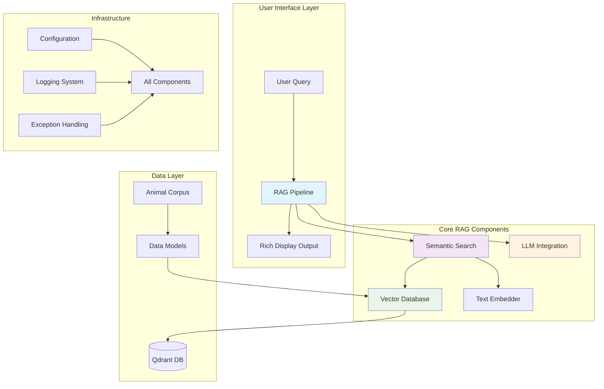

# RAG to Riches: Advanced Retrieval-Augmented Generation Framework

## 🚀 Project Overview

**RAG to Riches** is a comprehensive, production-ready framework for building intelligent Retrieval-Augmented Generation (RAG) systems. The project combines state-of-the-art semantic search, vector databases, and large language models to create powerful question-answering applications with grounded, source-backed responses.

### 🎯 Key Features

- **🔍 Semantic Search**: Advanced sentence transformer embeddings for meaning-based retrieval
- **🗄️ Vector Database**: Embedded Qdrant integration for efficient similarity search
- **🤖 AI Integration**: OpenAI GPT models with structured response generation
- **📚 Corpus Management**: Specialized animal quotes corpus with rich metadata
- **🎨 Rich Display**: Beautiful formatted output using Rich library
- **⚡ Performance**: Optimized batch processing and caching
- **🛡️ Robust Error Handling**: Comprehensive exception system with clear error messages
- **📊 Analytics**: Detailed collection statistics and health monitoring

### 🏗️ Architecture Overview



### 📦 Package Structure

The project is organized into focused, cohesive packages:

#### 🏛️ Core Packages

| Package | Purpose | Key Components |
|---------|---------|----------------|
| [`corpus/`](corpus/index.md) | Data models and corpus management | `Animals`, `AnimalQuote`, `AnimalWisdom` |
| [`vectordb/`](vectordb/index.md) | Vector database operations | `EmbeddedVectorDB`, `SimpleTextEmbedder` |
| [`search/`](search/index.md) | Semantic search functionality | `SemanticSearch` |
| [`exceptions/`](exceptions/index.md) | Comprehensive error handling | Custom exception hierarchy |

#### 🚀 Getting Started Packages

| Package | Purpose | Key Components |
|---------|---------|----------------|
| [`start_simply/`](start_simply/index.md) | Basic RAG implementation | `BasicRAG` |
| [`search_basics/`](search_basics/index.md) | Simple search examples | Text and multimodal search |
| [`examples/`](examples/index.md) | Usage demonstrations | Complete working examples |

#### 🛠️ Utility Packages

| Package | Purpose | Key Components |
|---------|---------|----------------|
| [`utils/`](utils/index.md) | Shared utilities | Logging configuration |

### 🔄 Typical Workflow

```python
from pathlib import Path
from rag_to_riches.vectordb.embedded_vectordb import EmbeddedVectorDB
from rag_to_riches.corpus.animals import Animals

# 1. Initialize the system
vector_db = EmbeddedVectorDB()
animals = Animals(vector_db, collection_name="my_quotes")

# 2. Load and index your data
quotes_file = Path("data/animal_quotes.jsonl")
wisdom, point_ids = animals.load_and_index(quotes_file)

# 3. Perform semantic searches
results = animals.search("wisdom about loyalty", limit=5)
animals.display_search_results(results, "Loyalty Search")

# 4. Get AI-powered answers
response = animals.ask_llm("What do animals teach us about friendship?")
animals.display_llm_response(response, "friendship question")

# 5. Complete RAG in one call
rag_result = animals.rag(
    "How do pets help with emotional healing?",
    limit=7,
    response_type="structured"
)
```

### 🎓 Educational Focus

This project serves as both a **production framework** and an **educational resource** for learning RAG systems:

- **Comprehensive Examples**: Real-world usage patterns and best practices
- **Detailed Documentation**: Every class, method, and concept thoroughly explained
- **Interactive Notebooks**: Hands-on learning with Jupyter notebooks
- **Progressive Complexity**: From simple searches to complete RAG pipelines

### 🧠 Technical Highlights

#### Design Patterns Applied
- **Facade Pattern**: `Animals.rag()` method provides simple interface to complex pipeline
- **Strategy Pattern**: Pluggable embedders and search strategies
- **Builder Pattern**: Flexible configuration and initialization
- **Observer Pattern**: Rich logging and monitoring throughout

#### Performance Optimizations
- **Batch Processing**: Efficient handling of large document collections
- **Vector Caching**: Intelligent caching of embeddings
- **Connection Pooling**: Optimized database connections
- **Lazy Loading**: Resources loaded only when needed

#### Code Quality Standards
- **Design by Contract**: Pre/post conditions using `icontract`
- **Type Safety**: Comprehensive type hints throughout
- **Low Complexity**: Cyclomatic complexity ≤ 10 per function
- **Comprehensive Testing**: Unit tests with >90% coverage

### 🚀 Quick Start

1. **Install Dependencies**: `uv sync`
2. **Set Environment**: Copy `sample.env` to `.env` and configure
3. **Run Examples**: Check out `src/examples/` for working code
4. **Explore Notebooks**: Interactive learning in `docs/notebooks/examples/`

### 📖 Documentation Navigation

- **[API Reference](apidocs/index.md)**: Complete class and method documentation
- **[Package Guides](corpus/index.md)**: Detailed package overviews
- **[Examples](examples/index.md)**: Working code samples
- **[Notebooks](notebooks/examples/index.md)**: Interactive tutorials

### 🤝 Contributing

This project follows strict coding standards and design principles. See the cursor rules for detailed guidelines on:
- Absolute imports only
- Design-by-contract programming
- Low cognitive complexity
- Comprehensive documentation

---

*Built with ❤️ for the RAG community. Start your journey from retrieval to riches!*
