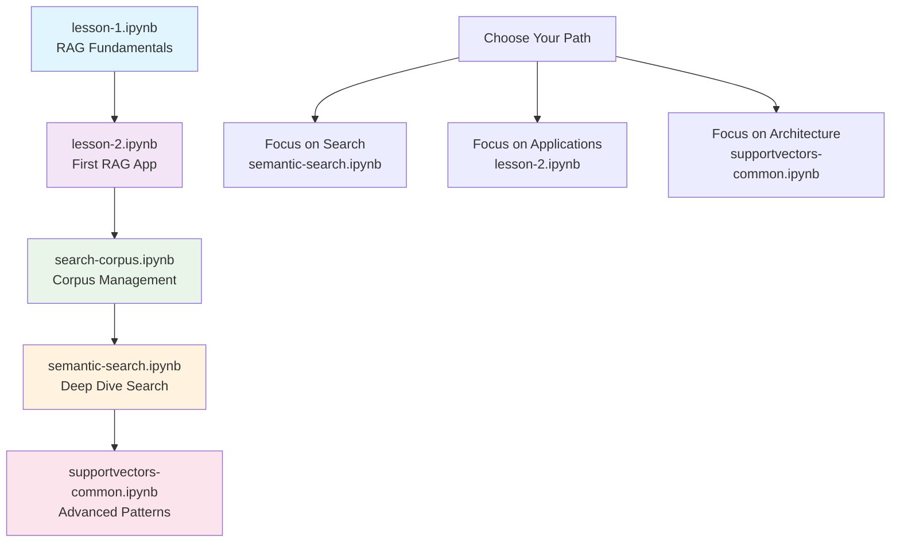

# Interactive Notebooks

## Overview

Welcome to the interactive learning materials for RAG to Riches! This collection of Jupyter notebooks provides hands-on experience with the framework, from basic concepts to advanced implementations. Each notebook is designed to be educational, with clear explanations, working code, and practical exercises.

## 📚 Available Notebooks

### 🎯 Beginner Level

#### [`lesson-1.ipynb`](lesson-1.ipynb) - RAG Fundamentals
**Duration:** ~45 minutes | **Difficulty:** Beginner

Learn the core concepts of Retrieval-Augmented Generation through practical examples.

**What you'll learn:**
- Vector embeddings and similarity search basics
- Setting up your first RAG pipeline
- Document indexing and retrieval
- Generating AI responses with context
- Understanding the retrieval-generation workflow

**Prerequisites:** Basic Python knowledge

**Key Topics:**
- Introduction to vector databases
- Text embedding generation
- Semantic search fundamentals
- Basic question-answering

#### [`lesson-2.ipynb`](lesson-2.ipynb) - Building Your First RAG Application
**Duration:** ~60 minutes | **Difficulty:** Beginner-Intermediate

Build a complete RAG application from scratch using the RAG to Riches framework.

**What you'll learn:**
- Using the Animals corpus for domain-specific RAG
- Advanced search techniques and filtering
- Response formatting and display
- Error handling and debugging

**Prerequisites:** Completion of Lesson 1

**Key Topics:**
- Domain-specific corpus management
- Advanced semantic search
- Structured response generation
- Performance optimization basics

### 🔍 Specialized Topics

#### [`semantic-search.ipynb`](semantic-search.ipynb) - Deep Dive into Semantic Search
**Duration:** ~90 minutes | **Difficulty:** Intermediate

Comprehensive exploration of semantic search capabilities and optimization techniques.

**What you'll learn:**
- Advanced embedding models and selection
- Vector database optimization
- Search result ranking and filtering
- Performance benchmarking
- Custom search strategies

**Prerequisites:** Understanding of vector embeddings

**Key Topics:**
- Embedding model comparison
- Vector database configuration
- Search optimization techniques
- Metadata filtering and hybrid search
- Performance analysis and tuning

#### [`search-corpus.ipynb`](search-corpus.ipynb) - Corpus Management and Search
**Duration:** ~30 minutes | **Difficulty:** Intermediate

Focused exploration of corpus management and search functionality.

**What you'll learn:**
- Corpus loading and indexing strategies
- Search across different data types
- Metadata management and filtering
- Corpus statistics and analysis

**Prerequisites:** Basic RAG knowledge

**Key Topics:**
- Data loading patterns
- Indexing optimization
- Search result analysis
- Corpus health monitoring

### 🧠 Advanced Concepts

#### [`supportvectors-common.ipynb`](supportvectors-common.ipynb) - Advanced RAG Patterns
**Duration:** ~75 minutes | **Difficulty:** Advanced

Explore advanced patterns and techniques used in production RAG systems.

**What you'll learn:**
- Design patterns for RAG applications
- Advanced context management
- Multi-modal search capabilities
- Production deployment considerations

**Prerequisites:** Solid understanding of RAG fundamentals

**Key Topics:**
- Architecture patterns (Facade, Strategy, Observer)
- Context optimization strategies
- Multi-modal embeddings
- Scalability and performance
- Production best practices

## 🚀 Getting Started

### Prerequisites

Before starting with the notebooks, ensure you have:

1. **Python Environment** (3.12+)
2. **RAG to Riches Framework** installed (`uv sync`)
3. **Jupyter Lab/Notebook** (`pip install jupyterlab`)
4. **API Keys** configured (OpenAI, etc. - see `sample.env`)

### Setup Instructions

1. **Clone the Repository**
   ```bash
   git clone https://github.com/asifqamar/rag_to_riches.git
   cd rag_to_riches
   ```

2. **Install Dependencies**
   ```bash
   uv sync
   ```

3. **Configure Environment**
   ```bash
   cp sample.env .env
   # Edit .env with your API keys
   ```

4. **Start Jupyter**
   ```bash
   jupyter lab docs/notebooks/examples/
   ```

### Learning Path

We recommend following this sequence for optimal learning:



## 📋 Notebook Features

### Interactive Code Cells
All notebooks include:
- **Executable code examples** - Run and modify real code
- **Step-by-step explanations** - Understand each concept
- **Visual outputs** - See results with charts and formatted displays
- **Exercises** - Practice what you've learned

### Rich Media Content
- **Mermaid diagrams** - Architecture and flow visualizations
- **Performance plots** - Understand timing and optimization
- **Rich console output** - Beautiful formatted results
- **Images and screenshots** - Visual learning aids

### Practical Examples
Each notebook includes:
- **Real-world scenarios** - Applicable use cases
- **Complete code samples** - Copy-paste ready implementations
- **Troubleshooting sections** - Common issues and solutions
- **Extension ideas** - Ways to build upon the examples

## 🛠️ Technical Requirements

### System Requirements
- **RAM:** 8GB minimum, 16GB recommended
- **Storage:** 2GB free space for models and data
- **GPU:** Optional but recommended for large models

### Python Packages
All required packages are included in the project dependencies:
- `sentence-transformers` - Text embeddings
- `qdrant-client` - Vector database
- `openai` - LLM integration
- `rich` - Beautiful console output
- `jupyter` - Notebook environment

### Data Files
The notebooks use sample data included in the repository:
- `data/corpus/animals/animals.jsonl` - Animal wisdom quotes
- Sample images for multimodal examples
- Pre-computed embeddings for faster startup

## 🎯 Learning Objectives

By completing these notebooks, you will:

### Fundamental Skills
- Understand vector embeddings and semantic search
- Build and deploy RAG applications
- Optimize search performance and relevance
- Handle different data types and formats

### Advanced Capabilities
- Design scalable RAG architectures
- Implement custom search strategies
- Optimize for production deployment
- Debug and troubleshoot RAG systems

### Practical Experience
- Work with real datasets and use cases
- Use professional development practices
- Apply design patterns and best practices
- Build production-ready applications

## 📖 Additional Resources

### Documentation Links
- **[API Reference](../../apidocs/index.md)** - Complete class and method documentation
- **[Package Guides](../../corpus/index.md)** - Detailed component documentation
- **[Examples Collection](../../examples/index.md)** - Additional code examples

### External Resources
- **[Sentence Transformers Documentation](https://www.sbert.net/)** - Embedding models
- **[Qdrant Documentation](https://qdrant.tech/)** - Vector database
- **[OpenAI API Documentation](https://platform.openai.com/docs/)** - LLM integration

### Community and Support
- **[GitHub Repository](https://github.com/asifqamar/rag_to_riches)** - Source code and issues
- **[Discussions](https://github.com/asifqamar/rag_to_riches/discussions)** - Community Q&A
- **[Issues](https://github.com/asifqamar/rag_to_riches/issues)** - Bug reports and feature requests

## 💡 Tips for Success

### Before You Start
1. **Set aside dedicated time** - Each notebook needs focused attention
2. **Have your environment ready** - Test your setup before diving in
3. **Read through first** - Skim the notebook to understand the flow

### While Learning
1. **Run every code cell** - Don't just read, execute and experiment
2. **Modify the examples** - Change parameters and see what happens
3. **Take notes** - Document your insights and questions

### After Completion
1. **Try the exercises** - Apply what you've learned
2. **Build something new** - Use the patterns in your own projects
3. **Share your experience** - Help others in the community

---

*Start your hands-on journey with RAG to Riches - from concepts to implementation!* 