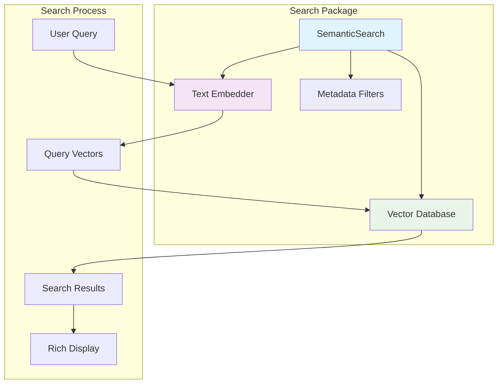

# Search Package

## Overview

The `search` package provides advanced semantic search functionality for the RAG to Riches framework. This package implements intelligent retrieval capabilities that go beyond simple keyword matching to understand the semantic meaning of queries and documents.

## Key Components

### SemanticSearch Class

**File**: `semantic_search.py`

The `SemanticSearch` class is the core component that provides sophisticated semantic search capabilities using vector embeddings and similarity matching.

#### Features

- **Vector-based Search**: Uses sentence transformer embeddings for semantic understanding
- **Flexible Filtering**: Supports metadata-based filtering of search results
- **Batch Processing**: Efficient handling of multiple search queries
- **Rich Result Display**: Beautiful formatted output using the Rich library
- **Performance Optimization**: Optimized for speed and accuracy

#### Key Methods

- `search()`: Performs semantic search with optional filtering
- `batch_search()`: Handles multiple queries efficiently
- `get_similar_documents()`: Retrieves documents based on similarity scores
- `display_results()`: Rich-formatted result presentation

## Architecture



## Usage Examples

### Basic Semantic Search

```python
from rag_to_riches.search.semantic_search import SemanticSearch
from rag_to_riches.vectordb.embedded_vectordb import EmbeddedVectorDB

# Initialize components
vector_db = EmbeddedVectorDB()
search_engine = SemanticSearch(vector_db, collection_name="my_collection")

# Perform semantic search
results = search_engine.search(
    query="wisdom about friendship",
    limit=5,
    score_threshold=0.7
)

# Display results
search_engine.display_results(results, "Friendship Search")
```

### Advanced Search with Filtering

```python
# Search with metadata filtering
filtered_results = search_engine.search(
    query="animal behavior",
    limit=10,
    metadata_filter={"category": "wildlife", "rating": {"$gte": 4.0}}
)
```

### Batch Search Processing

```python
# Process multiple queries efficiently
queries = [
    "leadership lessons",
    "courage in adversity", 
    "wisdom about patience"
]

batch_results = search_engine.batch_search(queries, limit=3)
```

## Integration

The search package integrates seamlessly with other RAG to Riches components:

- **Vector Database**: Works with `EmbeddedVectorDB` for efficient vector storage and retrieval
- **Corpus Management**: Integrates with corpus packages for domain-specific search
- **RAG Pipeline**: Serves as the retrieval component in complete RAG workflows

## Performance Considerations

- **Vector Indexing**: Optimized vector storage for fast similarity search
- **Caching**: Intelligent caching of embeddings and search results
- **Batch Processing**: Efficient handling of multiple search operations
- **Memory Management**: Optimized memory usage for large document collections

## Related Components

- [`vectordb/`](../vectordb/index.md): Vector database operations
- [`corpus/`](../corpus/index.md): Data models and corpus management
- [`start_simply/`](../start_simply/index.md): Basic RAG implementations using search

---

*Part of the RAG to Riches framework - building intelligent search from the ground up.* 