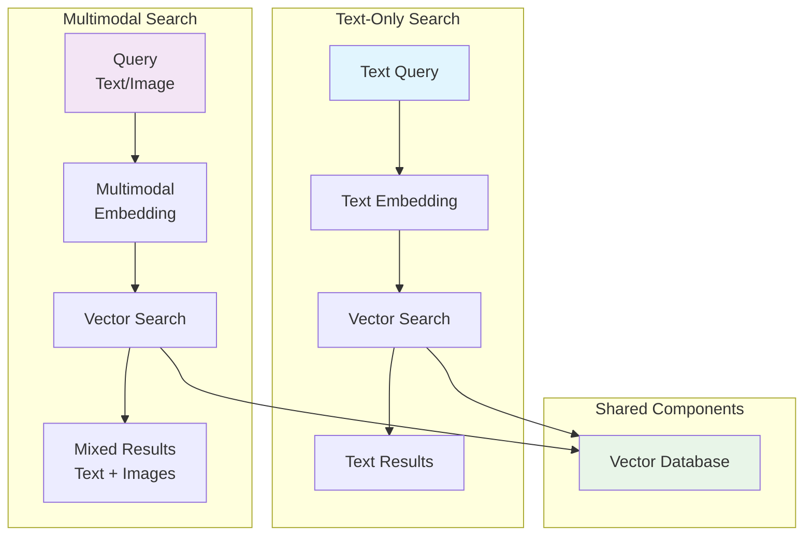

# Search Basics Package

## Overview

The `search_basics` package provides fundamental search implementations for the RAG to Riches framework. This package offers simple, educational implementations of both text-only and multimodal search capabilities, serving as building blocks for more complex search systems.

## Key Components

### Text-Only Search

**File**: `text_only_search.py`

A straightforward implementation of text-based semantic search that demonstrates core vector search concepts without additional complexity.

#### Features

- **Pure Text Search**: Focuses solely on textual content without multimedia elements
- **Vector Embeddings**: Uses sentence transformers for semantic understanding
- **Simple Interface**: Easy-to-understand API for learning and prototyping
- **Educational Value**: Clear code structure for understanding search fundamentals

### Multimodal Search

**File**: `multimodal_search.py`

An advanced implementation that combines text and image search capabilities, demonstrating how modern RAG systems can work with multiple data types.

#### Features

- **Text + Image Search**: Combines textual and visual information
- **Cross-Modal Retrieval**: Find images using text queries and vice versa
- **Unified Embeddings**: Single vector space for multiple modalities
- **Rich Media Support**: Handles various image formats and text combinations

## Architecture



## Getting Started

### Text-Only Search Example

```python
from rag_to_riches.search_basics.text_only_search import TextOnlySearch
from pathlib import Path

# Initialize text search
search_engine = TextOnlySearch(collection_name="simple_text_search")

# Add some documents
documents = [
    "The quick brown fox jumps over the lazy dog.",
    "Python is a powerful programming language for data science.",
    "Machine learning models require large amounts of training data.",
    "Natural language processing helps computers understand human language."
]

# Index the documents
search_engine.add_documents(documents)

# Perform searches
results = search_engine.search("programming languages", limit=2)
for idx, result in enumerate(results):
    print(f"{idx + 1}. {result['text']} (Score: {result['score']:.3f})")

# Output:
# 1. Python is a powerful programming language for data science. (Score: 0.845)
# 2. Natural language processing helps computers understand human language. (Score: 0.672)
```

### Multimodal Search Example

```python
from rag_to_riches.search_basics.multimodal_search import MultimodalSearch
from pathlib import Path

# Initialize multimodal search
mm_search = MultimodalSearch(collection_name="multimodal_demo")

# Add text documents
text_docs = [
    "A beautiful sunset over the ocean with orange and pink colors.",
    "A cute puppy playing in a green park with children.",
    "Modern architecture featuring glass and steel buildings."
]
mm_search.add_text_documents(text_docs)

# Add images with descriptions
image_paths = [
    Path("images/sunset.jpg"),
    Path("images/puppy.jpg"),
    Path("images/building.jpg")
]
mm_search.add_images(image_paths)

# Search with text to find related images and text
results = mm_search.search("cute animals", limit=5)
for result in results:
    if result['type'] == 'text':
        print(f"Text: {result['content']}")
    elif result['type'] == 'image':
        print(f"Image: {result['path']} - {result['description']}")

# Search with an image to find similar content
query_image = Path("query_images/dog.jpg")
visual_results = mm_search.search_by_image(query_image, limit=3)
```

## Text-Only Search Deep Dive

### Basic Setup

```python
from rag_to_riches.search_basics.text_only_search import TextOnlySearch

# Create a search instance
search = TextOnlySearch(
    collection_name="my_documents",
    embedding_model="all-MiniLM-L6-v2"  # Lightweight, fast model
)
```

### Adding Documents

```python
# Method 1: Add documents as a list
documents = [
    "Document 1 content here...",
    "Document 2 content here...",
    "Document 3 content here..."
]
search.add_documents(documents)

# Method 2: Add documents with metadata
docs_with_metadata = [
    {"text": "Content 1", "title": "Doc 1", "category": "science"},
    {"text": "Content 2", "title": "Doc 2", "category": "history"},
    {"text": "Content 3", "title": "Doc 3", "category": "literature"}
]
search.add_documents_with_metadata(docs_with_metadata)

# Method 3: Add single document
search.add_document("Single document content", metadata={"source": "manual"})
```

### Searching and Filtering

```python
# Basic search
results = search.search("machine learning", limit=5)

# Search with score threshold
high_quality_results = search.search(
    "artificial intelligence",
    limit=10,
    score_threshold=0.7  # Only return highly relevant results
)

# Search with metadata filtering
filtered_results = search.search(
    "scientific discovery",
    limit=5,
    metadata_filter={"category": "science"}
)

# Advanced search with multiple filters
complex_results = search.search(
    "historical events",
    limit=7,
    metadata_filter={
        "category": "history",
        "year": {"$gte": 1900}  # Published after 1900
    }
)
```

### Result Processing

```python
# Process search results
results = search.search("climate change", limit=5)

for i, result in enumerate(results):
    print(f"Result {i+1}:")
    print(f"  Text: {result['text'][:100]}...")  # First 100 chars
    print(f"  Score: {result['score']:.3f}")
    print(f"  Metadata: {result.get('metadata', {})}")
    print()

# Extract just the text content
text_content = [result['text'] for result in results]

# Get average relevance score
avg_score = sum(result['score'] for result in results) / len(results)
print(f"Average relevance: {avg_score:.3f}")
```

## Multimodal Search Deep Dive

### Setup and Configuration

```python
from rag_to_riches.search_basics.multimodal_search import MultimodalSearch

# Initialize with custom models
mm_search = MultimodalSearch(
    collection_name="multimodal_content",
    text_model="all-MiniLM-L6-v2",
    image_model="clip-ViT-B-32",  # CLIP model for image understanding
    device="cuda"  # Use GPU if available
)
```

### Adding Mixed Content

```python
# Add text documents
text_documents = [
    "A serene landscape with mountains and lakes.",
    "Urban photography capturing city life and architecture.",
    "Portrait photography with natural lighting techniques."
]
mm_search.add_text_documents(text_documents)

# Add images with automatic description generation
image_files = [
    Path("photos/landscape1.jpg"),
    Path("photos/city_scene.jpg"),
    Path("photos/portrait.jpg")
]
mm_search.add_images(image_files, auto_describe=True)

# Add images with custom descriptions
image_data = [
    {
        "path": Path("photos/sunset.jpg"),
        "description": "Beautiful golden hour sunset over a calm ocean",
        "metadata": {"location": "California", "time": "evening"}
    },
    {
        "path": Path("photos/forest.jpg"),
        "description": "Dense forest with tall pine trees and morning mist",
        "metadata": {"location": "Pacific Northwest", "time": "morning"}
    }
]
mm_search.add_images_with_metadata(image_data)
```

### Cross-Modal Search

```python
# Text query to find both text and images
mixed_results = mm_search.search(
    "peaceful nature scenes",
    limit=8,
    include_text=True,
    include_images=True
)

# Separate results by type
text_results = [r for r in mixed_results if r['type'] == 'text']
image_results = [r for r in mixed_results if r['type'] == 'image']

print(f"Found {len(text_results)} text matches and {len(image_results)} image matches")

# Image query to find similar images and related text
query_image = Path("query/example.jpg")
visual_matches = mm_search.search_by_image(
    query_image,
    limit=5,
    include_similar_text=True  # Also find related text descriptions
)
```

### Advanced Multimodal Features

```python
# Search with multiple query types
compound_results = mm_search.compound_search(
    text_query="mountain hiking",
    image_query=Path("query/hiking.jpg"),
    weight_text=0.6,  # 60% weight to text similarity
    weight_image=0.4,  # 40% weight to image similarity
    limit=10
)

# Filter by content type and metadata
filtered_mm_results = mm_search.search(
    "architectural photography",
    content_type="image",  # Only return images
    metadata_filter={"style": "modern"},
    limit=5
)

# Get embeddings for custom processing
text_embedding = mm_search.get_text_embedding("beautiful landscape")
image_embedding = mm_search.get_image_embedding(Path("test_image.jpg"))

# Calculate custom similarity
similarity = mm_search.calculate_similarity(text_embedding, image_embedding)
print(f"Cross-modal similarity: {similarity:.3f}")
```

## Performance Optimization

### Text-Only Search Optimization

```python
# Optimize for speed
fast_search = TextOnlySearch(
    collection_name="speed_optimized",
    embedding_model="all-MiniLM-L6-v2",  # Faster, smaller model
    batch_size=64,  # Process documents in batches
    max_doc_length=512  # Limit document length
)

# Pre-compute embeddings for static content
fast_search.precompute_embeddings()

# Use approximate search for very large collections
approx_results = fast_search.search(
    "query text",
    limit=10,
    approximate=True,  # Faster but slightly less accurate
    search_ef=100  # HNSW parameter for speed/accuracy tradeoff
)
```

### Multimodal Search Optimization

```python
# Memory-efficient multimodal search
efficient_mm = MultimodalSearch(
    collection_name="memory_optimized",
    text_model="all-MiniLM-L6-v2",
    image_model="clip-ViT-B-32",
    device="cpu",  # Use CPU to save GPU memory
    precision="float16",  # Use half precision for memory savings
    batch_size=16  # Smaller batches for memory efficiency
)

# Cache frequently used embeddings
efficient_mm.enable_embedding_cache(max_size=1000)

# Lazy loading for large image collections
efficient_mm.enable_lazy_loading()
```

## Educational Features

### Learning Progression

1. **Start with Text-Only**: Understand basic vector search concepts
2. **Add Metadata**: Learn about filtering and structured search
3. **Explore Multimodal**: Understand cross-modal retrieval
4. **Optimize Performance**: Learn about production considerations

### Code Examples for Learning

Each component includes extensive documentation and examples to help understand:

- How vector embeddings work
- The relationship between queries and results
- Performance vs. accuracy tradeoffs
- Memory and computational considerations

## Common Use Cases

### Document Search System

```python
# Build a simple document search for a knowledge base
doc_search = TextOnlySearch("company_docs")

# Load company documents
documents = load_company_documents()  # Your document loading function
doc_search.add_documents(documents)

# Employee searches for information
results = doc_search.search("vacation policy", limit=3)
display_search_results(results)
```

### Media Asset Management

```python
# Create a searchable media library
media_search = MultimodalSearch("media_assets")

# Index your media collection
media_search.add_images(Path("media_library").glob("*.jpg"))
media_search.add_text_documents(load_media_descriptions())

# Search for specific content
vacation_photos = media_search.search("beach vacation photos", limit=20)
```

## Related Components

- [`start_simply/`](../start_simply/index.md): Basic RAG implementation using these search components
- [`search/`](../search/index.md): Advanced semantic search capabilities
- [`vectordb/`](../vectordb/index.md): Understanding the underlying vector storage
- [`examples/`](../examples/index.md): Complete applications using search basics

---

*Part of the RAG to Riches framework - fundamental search capabilities for intelligent applications.* 