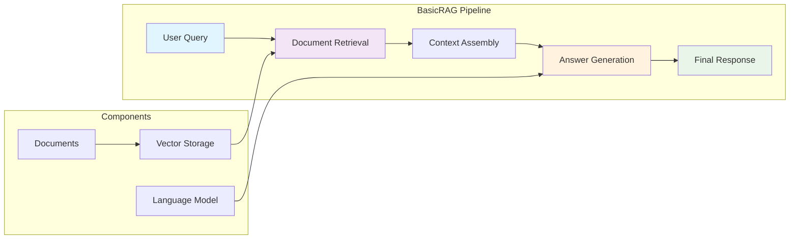

# Start Simply Package

## Overview

The `start_simply` package provides a streamlined entry point into the RAG to Riches framework. This package offers simplified, beginner-friendly implementations that demonstrate core RAG concepts without overwhelming complexity, making it perfect for getting started quickly.

## Key Components

### BasicRAG Class

**File**: `basic_rag.py`

The `BasicRAG` class provides a minimal, easy-to-understand implementation of a complete RAG (Retrieval-Augmented Generation) pipeline. This class abstracts away complexity while maintaining the core functionality needed for effective question-answering systems.

#### Features

- **Simple Interface**: Minimal setup required to get started
- **Complete Pipeline**: Full RAG functionality in a single class
- **Educational Focus**: Clear, well-documented code for learning
- **Quick Prototyping**: Ideal for rapid prototyping and experimentation
- **Foundation Building**: Serves as a foundation for more complex implementations

#### Core Functionality

- **Document Ingestion**: Easy loading and indexing of text documents
- **Semantic Retrieval**: Vector-based document retrieval
- **Answer Generation**: LLM-powered response generation
- **Context Integration**: Seamless integration of retrieved context with queries

## Architecture



## Getting Started

### Quick Start Example

```python
from rag_to_riches.start_simply.basic_rag import BasicRAG
from pathlib import Path

# Initialize BasicRAG
rag = BasicRAG()

# Load documents (supports various formats)
documents = [
    "The cat sat on the mat and purred contentedly.",
    "Dogs are loyal companions who love to play fetch.",
    "Birds can fly high in the sky using their wings."
]

# Index the documents
rag.add_documents(documents)

# Ask questions
response = rag.ask("What do cats do?")
print(response)
# Output: Based on the provided context, cats sit on mats and purr contentedly.

response = rag.ask("Tell me about loyal animals")
print(response)
# Output: Dogs are described as loyal companions who enjoy playing fetch.
```

### Step-by-Step Usage

#### 1. Initialize the System

```python
from rag_to_riches.start_simply.basic_rag import BasicRAG

# Create a BasicRAG instance
rag = BasicRAG(
    collection_name="my_first_rag",
    model_name="gpt-3.5-turbo"  # or your preferred model
)
```

#### 2. Add Your Documents

```python
# Option 1: Add documents directly
documents = [
    "Your first document content here...",
    "Your second document content here...",
    "More documents..."
]
rag.add_documents(documents)

# Option 2: Load from file
from pathlib import Path
text_file = Path("my_documents.txt")
rag.load_from_file(text_file)

# Option 3: Add one document at a time
rag.add_document("A single document to add to the collection")
```

#### 3. Start Asking Questions

```python
# Simple question-answering
answer = rag.ask("What is the main topic of the documents?")
print(f"Answer: {answer}")

# Get more detailed responses
detailed_answer = rag.ask(
    "Explain the key concepts mentioned in the documents",
    max_context_length=1000
)
print(f"Detailed Answer: {detailed_answer}")
```

#### 4. Inspect Retrieved Context

```python
# See what documents were retrieved for a query
query = "machine learning applications"
context = rag.get_context(query, num_results=3)
print(f"Retrieved context: {context}")

# Ask with visible context
answer_with_context = rag.ask_with_context(query)
print(f"Answer: {answer_with_context['answer']}")
print(f"Sources: {answer_with_context['sources']}")
```

## Educational Features

### Learning Progression

The `start_simply` package is designed for progressive learning:

1. **Start Here**: Begin with `BasicRAG` for fundamental concepts
2. **Understand Components**: Learn how retrieval and generation work together
3. **Explore Configuration**: Experiment with different settings and parameters
4. **Move Forward**: Graduate to more advanced packages as understanding grows

### Code Clarity

- **Minimal Dependencies**: Uses only essential components
- **Clear Naming**: Intuitive method and variable names
- **Comprehensive Comments**: Detailed explanations throughout the code
- **Simple Examples**: Easy-to-follow usage patterns

### Common Use Cases

#### Document Q&A System

```python
# Perfect for building a simple document Q&A system
rag = BasicRAG()

# Load your knowledge base
knowledge_base = [
    "Company policy: All employees must wear safety equipment in the lab.",
    "Office hours: Monday to Friday, 9 AM to 5 PM.",
    "Remote work: Available on Tuesdays and Thursdays."
]
rag.add_documents(knowledge_base)

# Answer questions about your documents
answer = rag.ask("What are the office hours?")
print(answer)  # "Office hours are Monday to Friday, 9 AM to 5 PM."
```

#### Personal Knowledge Assistant

```python
# Create a personal knowledge assistant
personal_rag = BasicRAG(collection_name="personal_notes")

# Add your notes and research
notes = [
    "Python best practices: Use type hints and docstrings.",
    "Meeting notes: Project deadline is next Friday.",
    "Research: RAG systems combine retrieval with generation."
]
personal_rag.add_documents(notes)

# Query your personal knowledge
insight = personal_rag.ask("What did I learn about Python?")
print(insight)
```

## Configuration Options

### Basic Configuration

```python
# Customize BasicRAG behavior
rag = BasicRAG(
    collection_name="custom_collection",
    model_name="gpt-4",  # Use different LLM
    embedding_model="all-MiniLM-L6-v2",  # Custom embeddings
    max_context_length=500,  # Limit context size
    temperature=0.7  # Control response creativity
)
```

### Performance Tuning

```python
# Optimize for your use case
rag = BasicRAG()

# Adjust retrieval settings
rag.set_retrieval_params(
    num_results=5,  # Number of documents to retrieve
    score_threshold=0.7,  # Minimum similarity score
    max_tokens_per_doc=200  # Limit document length
)

# Configure generation settings
rag.set_generation_params(
    max_tokens=150,  # Limit response length
    temperature=0.3,  # More focused responses
    top_p=0.9  # Nucleus sampling parameter
)
```

## Progression Path

### From Basic to Advanced

1. **Master BasicRAG**: Understand the fundamental pipeline
2. **Explore [`search_basics/`](../search_basics/index.md)**: Learn about different search strategies
3. **Study [`corpus/`](../corpus/index.md)**: Understand data modeling and management
4. **Use [`search/`](../search/index.md)**: Implement advanced semantic search
5. **Build Custom Solutions**: Combine components for specialized applications

### Next Steps

After mastering `BasicRAG`, consider exploring:

- **Custom Embeddings**: Experiment with different embedding models
- **Advanced Retrieval**: Implement hybrid search strategies
- **Domain Specialization**: Create domain-specific RAG systems
- **Performance Optimization**: Scale for larger document collections

## Troubleshooting

### Common Issues

#### No Results Returned

```python
# Check if documents were indexed properly
print(f"Number of documents: {len(rag.get_all_documents())}")

# Verify embedding generation
test_embedding = rag.embed_text("test query")
print(f"Embedding dimensions: {len(test_embedding)}")
```

#### Poor Answer Quality

```python
# Increase context length
rag.set_retrieval_params(
    num_results=10,  # Retrieve more documents
    max_tokens_per_doc=300  # Include more text per document
)

# Adjust generation parameters
rag.set_generation_params(
    temperature=0.1,  # More deterministic responses
    max_tokens=200  # Longer responses
)
```

#### Memory or Performance Issues

```python
# Optimize for performance
rag.set_retrieval_params(
    num_results=3,  # Fewer results
    max_tokens_per_doc=100  # Shorter documents
)

# Clear cache periodically
rag.clear_cache()
```

## Related Components

- [`search_basics/`](../search_basics/index.md): Simple search implementations
- [`examples/`](../examples/index.md): Complete usage examples
- [`vectordb/`](../vectordb/index.md): Understanding the underlying vector database
- [`corpus/`](../corpus/index.md): Advanced data modeling for specialized domains

---

*Part of the RAG to Riches framework - your first step into the world of intelligent document retrieval.* 