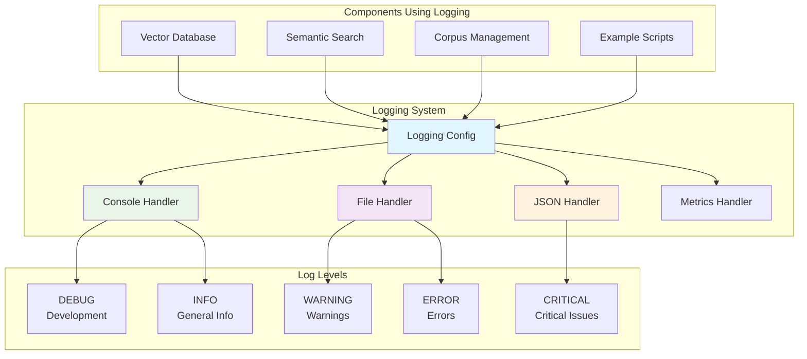

# Utils Package

## Overview

The `utils` package provides essential utility functions and configurations that support the entire RAG to Riches framework. This package focuses on cross-cutting concerns like logging, configuration management, and shared utilities that enhance the development and operational experience.

## Key Components

### Logging Configuration

**File**: `logging_config.py`

A comprehensive logging system designed for both development and production environments, providing structured, configurable logging throughout the RAG pipeline.

#### Features

- **Structured Logging**: Consistent log format across all components
- **Multiple Output Formats**: Console, file, and structured JSON logging
- **Log Level Management**: Configurable verbosity for different environments
- **Performance Monitoring**: Built-in timing and performance metrics
- **Error Tracking**: Enhanced error logging with context and stack traces
- **Rich Console Output**: Beautiful, colored console logs for development

## Architecture



## Getting Started

### Basic Logging Setup

```python
from rag_to_riches.utils.logging_config import setup_logging
import logging

# Initialize logging system
setup_logging()

# Get a logger for your module
logger = logging.getLogger(__name__)

# Use structured logging
logger.info("Starting RAG pipeline", extra={
    "operation": "initialization",
    "component": "rag_system",
    "collection_name": "my_collection"
})

logger.debug("Processing document", extra={
    "document_id": "doc_123",
    "document_length": 1500,
    "processing_stage": "embedding"
})

logger.error("Failed to connect to vector database", extra={
    "error_type": "connection_error",
    "database_url": "localhost:6333",
    "retry_count": 3
})
```

### Environment-Specific Configuration

```python
from rag_to_riches.utils.logging_config import setup_logging

# Development environment - verbose console logging
setup_logging(
    level="DEBUG",
    format_style="rich",  # Colored, formatted console output
    enable_file_logging=False,
    enable_metrics=True
)

# Production environment - structured file logging
setup_logging(
    level="INFO",
    format_style="json",  # Structured JSON for log aggregation
    enable_file_logging=True,
    log_file="rag_system.log",
    enable_metrics=True,
    enable_error_tracking=True
)

# Testing environment - minimal logging
setup_logging(
    level="WARNING",
    format_style="simple",
    enable_file_logging=False,
    enable_metrics=False
)
```

## Logging Configuration Features

### Rich Console Logging

Perfect for development and debugging:

```python
from rag_to_riches.utils.logging_config import setup_rich_logging

# Enable beautiful console logging
setup_rich_logging()

logger = logging.getLogger(__name__)

# Rich formatting automatically handles complex data
logger.info("Search results", extra={
    "query": "machine learning",
    "results_count": 15,
    "avg_score": 0.847,
    "processing_time": 0.245,
    "metadata": {
        "collection": "research_papers",
        "embedding_model": "all-MiniLM-L6-v2"
    }
})

# Output will be beautifully formatted with:
# - Color coding by log level
# - Structured display of complex data
# - Timestamps and context information
# - Easy-to-read hierarchical data
```

### Structured JSON Logging

Ideal for production systems and log aggregation:

```python
from rag_to_riches.utils.logging_config import setup_json_logging

# Enable JSON structured logging
setup_json_logging(log_file="rag_system.jsonl")

logger = logging.getLogger(__name__)

logger.info("Document indexed successfully", extra={
    "event_type": "document_indexed",
    "document_id": "doc_456",
    "collection_name": "knowledge_base",
    "vector_dimensions": 384,
    "indexing_time_ms": 125,
    "success": True
})

# JSON output:
# {
#   "timestamp": "2024-01-15T10:30:45.123Z",
#   "level": "INFO",
#   "logger": "rag_to_riches.corpus.animals",
#   "message": "Document indexed successfully",
#   "event_type": "document_indexed",
#   "document_id": "doc_456",
#   "collection_name": "knowledge_base",
#   "vector_dimensions": 384,
#   "indexing_time_ms": 125,
#   "success": true
# }
```

### Performance Monitoring

Built-in performance tracking and metrics:

```python
from rag_to_riches.utils.logging_config import get_performance_logger
import time

perf_logger = get_performance_logger()

# Method 1: Context manager for timing
from rag_to_riches.utils.logging_config import log_performance

@log_performance("embedding_generation")
def generate_embeddings(texts):
    # Your embedding logic here
    return embeddings

# Method 2: Manual timing
start_time = time.time()
results = search_engine.search("query", limit=10)
duration = time.time() - start_time

perf_logger.info("Search completed", extra={
    "operation": "semantic_search",
    "query_length": len("query"),
    "results_count": len(results),
    "duration_ms": duration * 1000,
    "avg_score": sum(r['score'] for r in results) / len(results)
})

# Method 3: Decorator with context
@log_performance("document_processing", include_memory=True)
def process_documents(documents):
    # Processing logic
    return processed_docs
```

### Error Tracking and Context

Enhanced error logging with full context:

```python
from rag_to_riches.utils.logging_config import get_error_logger

error_logger = get_error_logger()

try:
    # Some RAG operation
    results = vector_db.search(query_vector)
    
except Exception as e:
    error_logger.error(
        "Vector search failed",
        extra={
            "error_type": type(e).__name__,
            "error_message": str(e),
            "query_dimensions": len(query_vector),
            "collection_name": "my_collection",
            "operation_context": {
                "function": "semantic_search",
                "step": "vector_query",
                "parameters": {
                    "limit": 10,
                    "score_threshold": 0.7
                }
            }
        },
        exc_info=True  # Include full stack trace
    )
    raise
```

## Advanced Logging Patterns

### Contextual Logging

Maintain context across related operations:

```python
from rag_to_riches.utils.logging_config import LoggingContext
import logging

logger = logging.getLogger(__name__)

# Create a logging context for a RAG session
with LoggingContext(
    session_id="session_123",
    user_id="user_456",
    operation="rag_query"
):
    logger.info("Starting RAG query")
    
    # All logs within this context will include session info
    search_results = search_engine.search(query)
    logger.info(f"Retrieved {len(search_results)} results")
    
    llm_response = llm.generate(query, context=search_results)
    logger.info("Generated LLM response")
    
    # Context information is automatically included in all logs
```

### Correlation IDs

Track operations across the entire pipeline:

```python
from rag_to_riches.utils.logging_config import with_correlation_id
import uuid

@with_correlation_id
def process_rag_request(query: str):
    """Process a RAG request with full traceability."""
    
    correlation_id = str(uuid.uuid4())
    logger = logging.getLogger(__name__)
    
    logger.info("Processing RAG request", extra={
        "correlation_id": correlation_id,
        "query_preview": query[:50]
    })
    
    # All subsequent operations will include the correlation ID
    search_results = search_documents(query)
    llm_response = generate_response(query, search_results)
    
    logger.info("RAG request completed", extra={
        "correlation_id": correlation_id,
        "response_length": len(llm_response)
    })
    
    return llm_response
```

### Custom Log Filters

Filter logs based on context or content:

```python
from rag_to_riches.utils.logging_config import add_log_filter

# Filter out low-priority debug messages
def development_filter(record):
    if record.levelno == logging.DEBUG:
        return "performance" in record.getMessage()
    return True

add_log_filter("development_filter", development_filter)

# Filter sensitive information
def security_filter(record):
    # Remove or mask sensitive data from logs
    if hasattr(record, 'api_key'):
        record.api_key = "***masked***"
    if hasattr(record, 'user_email'):
        record.user_email = record.user_email.replace('@', '@***')
    return True

add_log_filter("security_filter", security_filter)
```

## Configuration Management

### Log Level Configuration

```python
from rag_to_riches.utils.logging_config import configure_log_levels

# Set different levels for different components
configure_log_levels({
    "rag_to_riches.vectordb": "DEBUG",
    "rag_to_riches.search": "INFO", 
    "rag_to_riches.corpus": "INFO",
    "rag_to_riches.examples": "WARNING",
    "requests": "WARNING",  # Reduce third-party library noise
    "urllib3": "ERROR"
})
```

### Dynamic Configuration

Update logging configuration at runtime:

```python
from rag_to_riches.utils.logging_config import update_logging_config

# Switch to debug mode dynamically
update_logging_config({
    "level": "DEBUG",
    "enable_performance_logging": True,
    "add_memory_metrics": True
})

# Switch to production mode
update_logging_config({
    "level": "INFO",
    "format_style": "json",
    "enable_file_logging": True,
    "log_rotation": True
})
```

## Integration with RAG Components

### Vector Database Logging

```python
from rag_to_riches.vectordb.embedded_vectordb import EmbeddedVectorDB
from rag_to_riches.utils.logging_config import setup_logging

setup_logging()
vector_db = EmbeddedVectorDB()

# Automatic logging of database operations
vector_db.create_collection("my_collection")  # Logs: Collection created
vector_db.add_vectors(vectors, metadata)       # Logs: Vectors added (count, dimensions)
results = vector_db.search(query_vector)       # Logs: Search completed (results, time)
```

### Search Operation Logging

```python
from rag_to_riches.search.semantic_search import SemanticSearch

search_engine = SemanticSearch(vector_db, collection_name="docs")

# Automatic logging includes:
# - Query processing time
# - Number of results found
# - Average relevance scores
# - Performance metrics
results = search_engine.search("machine learning applications")
```

### Corpus Management Logging

```python
from rag_to_riches.corpus.animals import Animals

animals = Animals(vector_db, collection_name="animal_wisdom")

# Comprehensive logging of corpus operations:
# - Data loading progress
# - Indexing performance
# - Search analytics
# - Error recovery
wisdom_data, point_ids = animals.load_and_index(data_file)
```

## Production Considerations

### Log Rotation and Management

```python
from rag_to_riches.utils.logging_config import setup_production_logging

setup_production_logging(
    log_file="rag_system.log",
    max_file_size="100MB",
    backup_count=5,
    compression=True,
    rotation_schedule="daily"
)
```

### Monitoring and Alerting Integration

```python
from rag_to_riches.utils.logging_config import enable_monitoring_hooks

# Integration with monitoring systems
enable_monitoring_hooks(
    error_webhook="https://alerts.example.com/webhook",
    metrics_endpoint="https://metrics.example.com/api/logs",
    alert_on_error_rate=True,
    performance_threshold_ms=1000
)
```

### Security and Compliance

```python
from rag_to_riches.utils.logging_config import enable_security_logging

enable_security_logging(
    mask_sensitive_data=True,
    audit_access_logs=True,
    comply_with_gdpr=True,
    retention_period_days=90
)
```

## Usage Examples

### Development Workflow

```python
from rag_to_riches.utils.logging_config import setup_development_logging

# Perfect for debugging and development
setup_development_logging()

# Your development code here
# Logs will be colorful, detailed, and easy to read
```

### Production Deployment

```python
from rag_to_riches.utils.logging_config import setup_production_logging

# Optimized for production environments
setup_production_logging(
    log_level="INFO",
    structured_format=True,
    enable_metrics=True,
    enable_alerting=True
)
```

### Testing Environment

```python
from rag_to_riches.utils.logging_config import setup_testing_logging

# Minimal logging for tests
setup_testing_logging(
    capture_logs=True,  # Capture for test assertions
    suppress_external_logs=True
)
```

## Related Components

- [`exceptions/`](../exceptions/index.md): Error logging integrates with the exception system
- [`vectordb/`](../vectordb/index.md): Database operations are logged for monitoring
- [`search/`](../search/index.md): Search performance and results are logged
- [`corpus/`](../corpus/index.md): Corpus operations include comprehensive logging

---

*Part of the RAG to Riches framework - essential utilities for robust, observable applications.* 