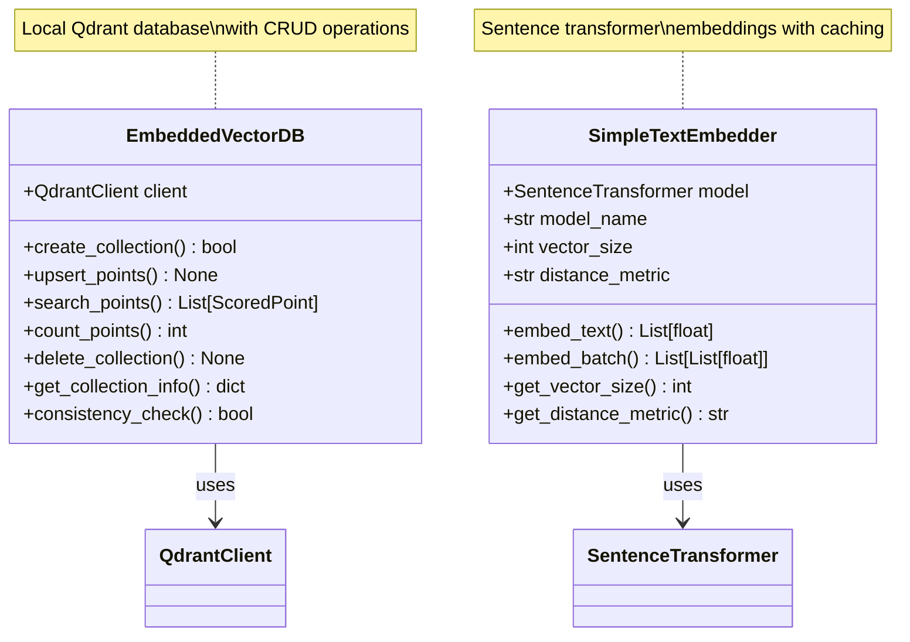
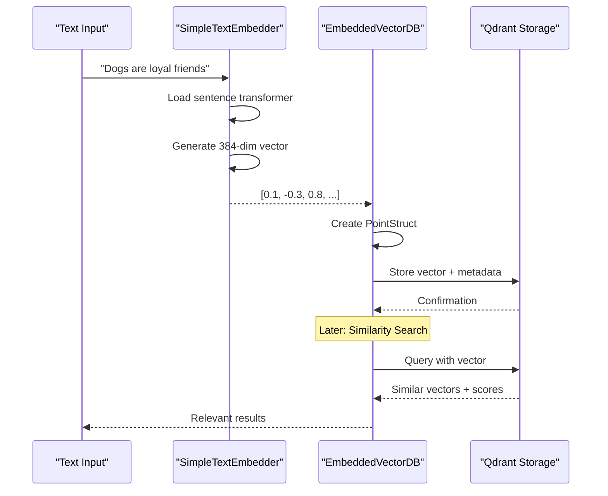

# Vector Database Package: Embeddings and Storage

## 📖 Package Overview

The `vectordb` package provides the foundational infrastructure for vector-based semantic search in the RAG to Riches framework. It combines advanced text embedding capabilities with efficient vector storage and retrieval using Qdrant, creating a powerful foundation for similarity search and retrieval-augmented generation.

### 🎯 Package Purpose

This package transforms text into high-dimensional vector representations and provides persistent storage with lightning-fast similarity search. It handles the complete pipeline from text encoding to vector database operations, making semantic search accessible and efficient for RAG applications.

### 🏗️ Architecture



### 📦 Components

#### 🏛️ Core Components

| Component | File | Purpose |
|-----------|------|---------|
| [`EmbeddedVectorDB`](EmbeddedVectorDB.md) | `embedded_vectordb.py` | Local Qdrant database operations |
| [`SimpleTextEmbedder`](SimpleTextEmbedder.md) | `embedder.py` | Text-to-vector transformation |

#### 🔄 Typical Data Flow



### 💡 Key Features

#### 🔍 Advanced Text Embedding
- **State-of-the-Art Models**: Sentence transformers optimized for semantic understanding
- **Flexible Model Selection**: Support for various embedding models and sizes
- **Batch Processing**: Efficient handling of large text collections
- **Caching**: Intelligent caching to avoid redundant computations

#### 🗄️ Vector Database Operations
- **Local Storage**: Embedded Qdrant for development and production
- **CRUD Operations**: Complete create, read, update, delete functionality
- **Collection Management**: Flexible collection creation and configuration
- **Health Monitoring**: Consistency checks and database statistics

#### ⚡ Performance Optimizations
- **GPU Acceleration**: Automatic GPU usage when available
- **Connection Pooling**: Efficient database connection management
- **Batch Operations**: Optimized batch insert and search operations
- **Memory Management**: Efficient memory usage for large collections

### 🚀 Quick Start Example

```python
from pathlib import Path
from rag_to_riches.vectordb.embedded_vectordb import EmbeddedVectorDB
from rag_to_riches.vectordb.embedder import SimpleTextEmbedder

# Initialize components
vector_db = EmbeddedVectorDB()
embedder = SimpleTextEmbedder()

# Create a collection
collection_name = "example_quotes"
vector_db.create_collection(
    collection_name=collection_name,
    vector_size=embedder.get_vector_size(),
    distance=embedder.get_distance_metric()
)

# Embed and store text
texts = [
    "Dogs are loyal companions who bring joy to our lives.",
    "Cats are independent creatures with mysterious personalities.",
    "Birds teach us about freedom and the beauty of flight."
]

# Generate embeddings
vectors = embedder.embed_batch(texts)

# Create points for storage
from uuid import uuid4
from qdrant_client import models

points = []
for i, (text, vector) in enumerate(zip(texts, vectors)):
    point = models.PointStruct(
        id=str(uuid4()),
        vector=vector,
        payload={"content": text, "index": i}
    )
    points.append(point)

# Store in database
vector_db.upsert_points(collection_name, points)

# Search for similar content
query_text = "loyal pets and friendship"
query_vector = embedder.embed_text(query_text)
results = vector_db.search_points(collection_name, query_vector, limit=2)

# Display results
for result in results:
    print(f"Score: {result.score:.3f}")
    print(f"Text: {result.payload['content']}")
    print("---")
```

### 🛠️ Configuration Options

#### Embedding Model Selection

```python
# Default model (balanced performance/quality)
embedder = SimpleTextEmbedder()  # Uses 'sentence-transformers/all-MiniLM-L6-v2'

# High-quality model (larger, slower)
embedder = SimpleTextEmbedder(model_name="sentence-transformers/all-mpnet-base-v2")

# Fast model (smaller, faster)
embedder = SimpleTextEmbedder(model_name="sentence-transformers/all-MiniLM-L12-v2")

# Multilingual model
embedder = SimpleTextEmbedder(model_name="sentence-transformers/paraphrase-multilingual-MiniLM-L12-v2")
```

#### Vector Database Configuration

```python
# Custom database path (via config)
config = {
    "vector_db": {
        "path": "/custom/path/to/qdrant"
    }
}

# Different distance metrics
vector_db.create_collection(
    collection_name="cosine_collection",
    vector_size=384,
    distance="Cosine"  # Options: "Cosine", "Euclid", "Dot"
)
```

### 🔧 Advanced Usage

#### Batch Processing for Large Collections

```python
# Efficient batch processing
large_text_collection = [...]  # Thousands of texts

# Process in batches to manage memory
batch_size = 100
for i in range(0, len(large_text_collection), batch_size):
    batch_texts = large_text_collection[i:i+batch_size]
    batch_vectors = embedder.embed_batch(batch_texts)
    
    # Create points
    batch_points = []
    for j, (text, vector) in enumerate(zip(batch_texts, batch_vectors)):
        point = models.PointStruct(
            id=str(uuid4()),
            vector=vector,
            payload={"content": text, "batch": i//batch_size, "index": j}
        )
        batch_points.append(point)
    
    # Store batch
    vector_db.upsert_points(collection_name, batch_points)
    print(f"Processed batch {i//batch_size + 1}")
```

#### Collection Management

```python
# List all collections
collections = vector_db.list_collections()
print(f"Available collections: {collections}")

# Get collection statistics
stats = vector_db.get_collection_info("my_collection")
print(f"Collection has {stats['points_count']} points")

# Check collection health
if vector_db.collection_exists("my_collection"):
    count = vector_db.count_points("my_collection")
    print(f"Collection is healthy with {count} points")
```

#### Advanced Search Options

```python
# Search with score threshold
results = vector_db.search_points(
    collection_name="quotes",
    query_vector=query_vector,
    limit=10,
    score_threshold=0.7  # Only return highly similar results
)

# Search with metadata filtering (requires Qdrant filters)
from qdrant_client.models import Filter, FieldCondition, MatchValue

filter_condition = Filter(
    must=[
        FieldCondition(
            key="category",
            match=MatchValue(value="pets")
        )
    ]
)

# Note: This requires additional implementation in EmbeddedVectorDB
# filtered_results = vector_db.search_points_with_filter(
#     collection_name, query_vector, filter_condition
# )
```

### 🔗 Integration with Other Packages

The vectordb package seamlessly integrates with other framework components:

#### With Corpus Package

```python
from rag_to_riches.corpus.animals import Animals

# Animals class uses vectordb internally
animals = Animals(vector_db, embedder)
wisdom = animals.load_from_jsonl("quotes.jsonl")
animals.index_all_quotes()  # Uses vectordb for storage
```

#### With Search Package

```python
from rag_to_riches.search.semantic_search import SemanticSearch

# SemanticSearch combines embedder and vector_db
search = SemanticSearch(
    embedder=embedder,
    vector_db=vector_db,
    collection_name="search_collection"
)
```

### 🛡️ Error Handling

The package provides comprehensive error handling with custom exceptions:

```python
from rag_to_riches.exceptions import (
    VectorDatabasePathNotFoundError,
    CollectionAlreadyExistsError,
    CollectionNotFoundError,
    InvalidVectorSizeError,
    InvalidDistanceMetricError
)

try:
    # This might fail if collection exists
    vector_db.create_collection("existing_collection", 384, "Cosine")
except CollectionAlreadyExistsError as e:
    print(f"Collection already exists: {e}")
    # Handle gracefully - maybe use existing collection

try:
    # This might fail if collection doesn't exist
    count = vector_db.count_points("nonexistent_collection")
except CollectionNotFoundError as e:
    print(f"Collection not found: {e}")
    # Create collection or handle error
```

### 📊 Performance Considerations

#### Memory Usage

- **Embedding Models**: Models are loaded once and cached in memory
- **Batch Size**: Optimize batch sizes based on available memory
- **Vector Storage**: Qdrant efficiently manages vector storage on disk

#### Speed Optimization

- **GPU Acceleration**: Automatically uses GPU if available for embeddings
- **Parallel Processing**: Sentence transformers support parallel batch processing
- **Connection Reuse**: Database connections are reused for efficiency

#### Scalability

- **Collection Size**: Qdrant can handle millions of vectors efficiently
- **Search Speed**: Sub-second search times for most collection sizes
- **Storage**: Efficient compression and indexing for large datasets

### 🎯 Use Cases

- **Semantic Search**: Find similar documents based on meaning
- **Content Recommendation**: Suggest related content to users
- **Duplicate Detection**: Identify similar or duplicate content
- **Content Clustering**: Group similar content automatically
- **Question Answering**: Find relevant context for user questions

### 📚 Detailed Documentation

- **[EmbeddedVectorDB Class](EmbeddedVectorDB.md)**: Complete database operations
- **[SimpleTextEmbedder Class](SimpleTextEmbedder.md)**: Text embedding and transformation

### 🔧 Dependencies

The vectordb package relies on several key technologies:

- **Qdrant**: High-performance vector database
- **Sentence Transformers**: State-of-the-art text embeddings
- **PyTorch**: Deep learning framework for embeddings
- **Loguru**: Comprehensive logging
- **icontract**: Design-by-contract validation

---

*The vectordb package provides the essential infrastructure for semantic search - transforming text into meaningful vectors and storing them efficiently for lightning-fast similarity search. Perfect for building intelligent applications that understand content meaning rather than just keywords.* 